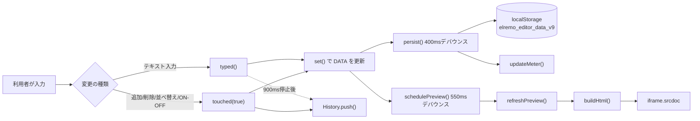
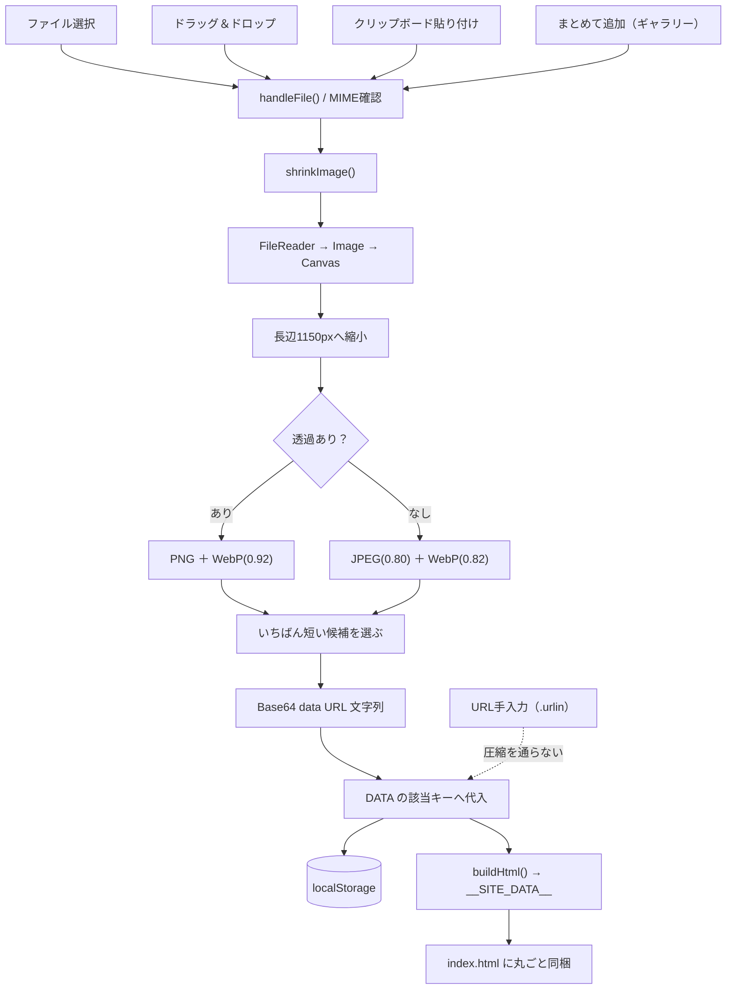
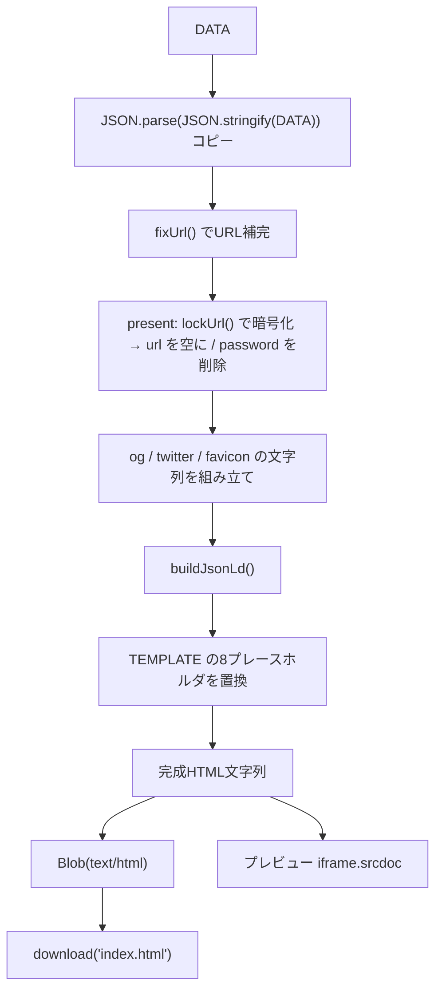
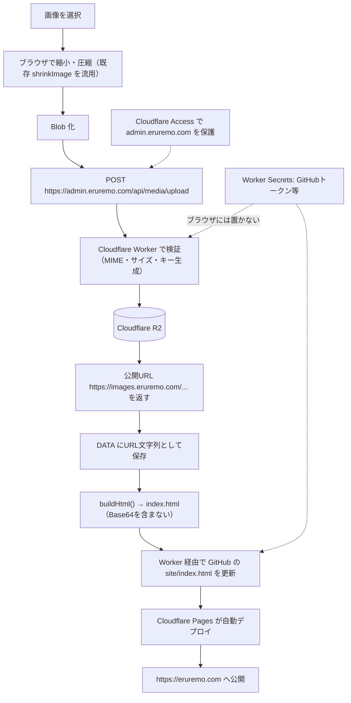

# 現在の構成（CURRENT ARCHITECTURE）

対象ファイル：`<project-root>\eruremo_SiteManager.html`
解析日：2026-08-05 ／ Phase 1（解析のみ・コード無変更）

| 項目 | 値 |
|---|---|
| ファイルサイズ | 2,110,402 バイト（約 2.01 MB） |
| 行数 | 2,016 行 |
| 文字コード | UTF-8（BOM なし） |
| 改行コード | LF（CRLF は 0 件） |
| SHA-256 | `42FD31BB6829839725DFFD01ADA031FC60F867CBB944C7C2D60BDFF44BF9DF51` |
| 画面タイトル | 「えるれも サイトエディタ v9 ✎」 |

---

## 1. ファイル全体の構造

単一HTMLファイルに、**エディタのUI・CSS・JavaScript・公開サイトのテンプレート・初期データ**が全部入っています。

```
eruremo_SiteManager.html   全2,016行
├─ 1–9行     <head> メタ情報 ＋ Google Fonts の <link>
├─ 10–309行  <style>  エディタ自身のCSS（約300行）
├─ 311–389行 <body>   エディタのUI骨格（トップバー／3ペイン／モーダル等）
└─ 390–2014行 <script> エディタのJavaScript（インライン1本のみ）
    ├─ 394–398行  decodeB64()  Base64→UTF-8 復号ヘルパー
    ├─ 399行      const TEMPLATE     = decodeB64("…")  ← 204,876文字のBase64
    ├─ 400行      const DEFAULT_DATA = JSON.parse(decodeB64("…")) ← 1,792,436文字のBase64
    └─ 402–2013行 本体ロジック
```

**重要：399行目と400行目の2行だけで、ファイル全体の約 95% を占めています。**
（他の 2,014 行はすべて 200 文字未満）

### 外部依存はこの2箇所だけ（エディタ側）

| 種別 | 内容 | 場所 |
|---|---|---|
| 外部フォント | `https://fonts.googleapis.com` / `fonts.gstatic.com`（Zen Maru Gothic / Fredoka） | 7–9行 |
| 外部CSS | 上記 Google Fonts の CSS のみ | 9行 |
| 外部JS | **なし**（ライブラリ0・CDN0・npm依存0） | — |
| 外部API | **なし**（エディタ自身は一切通信しない） | — |

zip生成（`makeZip`）も、暗号化（`crypto.subtle`）も、画像圧縮（Canvas）も**すべて自前実装**です。
外部パッケージは1つも使っていません。

---

## 2. 埋め込まれている2つのBase64

### 2-1. `TEMPLATE`（399行目）

- Base64 長：204,876 文字 → 復号後 **153,655 バイト／2,641 行**
- 中身：**公開サイト（index.html）の完全なひな形**。CSS・JS・HTMLがすべて入った単一HTML。
- 差し込み口（プレースホルダ）は次の 8 個だけ：

```
__PAGE_TITLE__     ページタイトル（<title>, og:site_name, og:title, twitter:title）
__PAGE_DESC__      説明文（description, og:description, twitter:description）
__THEME_COLOR__    theme-color メタタグ
__OG_EXTRA__       og:image / og:image:width / og:image:height / og:url / canonical
__TWITTER_EXTRA__  twitter:image または twitter:card
__FAVICON__        <link rel="icon">
__JSONLD__         <script type="application/ld+json"> の中身
__SITE_DATA__      サイトの全データ（JSON）
```

`__SITE_DATA__` は生成HTMLの末尾付近、次の形で埋め込まれます（**HTML読み込み機能はこの目印を探します**）：

```html
<script>
/* ==== サイトの中身データ（編集ツールが書き換えます / SITE_DATA_START ==== */
const SITE_DATA = { …JSON… };
/* ==== SITE_DATA_END ==== */

const D = SITE_DATA;
…（以下、公開サイトの描画ロジック）
```

### 2-2. `DEFAULT_DATA`（400行目）

- Base64 長：1,792,436 文字 → 復号後 **1,344,326 バイト（約 1.28 MB）の JSON**
- 「お手本」の初期データ。**この中に Base64 画像が 15 枚（PNG 1枚・JPEG 14枚、合計約 978 KB）入っています。**
- つまり **初回起動しただけで、localStorage に約 1.3 MB を書き込む** 状態です。

---

## 3. エディタのUI構造

```
.app
├─ .topbar（トップバー・常時表示）
│   ├─ ロゴ「✎ えるれも サイトエディタ v9」
│   ├─ #status     保存ステータス（保存済み／保存中…／保存できません）
│   ├─ #meter      容量メーター（バー＋数値、目安 4.2MB）
│   ├─ #search     横断検索（Ctrl+F）＋ #searchRes 結果ドロップダウン
│   ├─ #btnUndo / #btnRedo
│   ├─ #btnPreviewMobile（幅1180px以下でのみ表示）
│   ├─ #btnCheck   書き出し前チェック
│   ├─ #btnMenu → #menu（data-act 属性でアクション分岐）
│   ├─ #btnDownload 「⬇ ホームページを保存」（primary）
│   └─ #fileHtml / #fileJson （hidden な file input）
└─ .main（CSS Grid 3カラム：210px / 1fr / 1.1fr）
    ├─ #tabs      左のタブレール（SCHEMAから自動生成・👁で表示ON/OFF・件数バッジ）
    ├─ #formPane  中央の編集フォーム（activeTabの内容を毎回作り直し）
    └─ #previewPane 右のプレビュー
        ├─ .pv-bar  PC/タブレット/スマホ切替・🔄再構築・↗別タブ
        └─ #pvFrame <iframe>（srcdoc で描画）

#checkPanel  右下固定のチェック結果パネル
#modal       中央モーダル（ヘルプ・画像拡大・URL方式の案内）
#toastStack  下部中央のトースト通知
```

### レスポンシブ

| 画面幅 | 挙動 |
|---|---|
| 1181px 以上 | 3カラム（タブ／フォーム／プレビュー） |
| 1180px 以下 | プレビュー非表示。`--rail:170px` の2カラム。「👀 プレビュー」ボタンで全画面表示 |
| 700px 以下 | `--rail:0`。タブが**下部の横スクロールバー**に変化。容量メーター・ロゴ装飾を非表示 |

---

## 4. 編集データの構造

- メイン変数：**`let DATA`**（425行目）
- 初期値：`boot()` の戻り値（localStorage → 旧キー → `DEFAULT_DATA` の順）
- 参照/書き込みヘルパー：`get(path)` / `set(path, value)`（"a.b.c" のドット記法）

```
DATA
├─ pageTitle       : string   サイト名
├─ pageDesc        : string   サイト説明文
├─ logo            : string   ロゴ画像（data URL または URL/相対パス）
├─ bgTheme         : string   "auto" | "none" | "m1"…"m12"
├─ theme           : { night, star, sora, yume, sakura }  すべて #rrggbb
├─ show            : { about, cast, staff, history, shop, present,
│                      board, faq, info, join, gallery } すべて boolean
├─ splash          : { text }
├─ hero            : { eyebrow, catch, sub, btn1, btn2 }
├─ penMessages     : string[]   ペンチャット（初期5件）
├─ ticker          : string[]   流れる改変ログ（初期6件）
├─ about
│   ├─ title, lead, photo, photoAlt, photoCap
│   └─ cards[]     : { icon, title, text, color }         初期3件
├─ cast
│   ├─ title, note
│   ├─ members[]   : { photo, photoAlt, cap, profilePhoto,
│   │                  name, position, role, color, x }   初期2件
│   └─ chips[]     : string[]                             初期4件
├─ staff
│   ├─ title, lead
│   └─ members[]   : { photo, photoAlt, emoji, name, role, comment, x } 初期1件
├─ history
│   ├─ title
│   └─ items[]     : { date, title, desc, photo, photoAlt, cap, badge } 初期3件
├─ shop            : { title, eyebrow, headline, desc, priceWas, priceNow,
│                      btn, url, photo, photoAlt, photoCap }
├─ present
│   ├─ title, lead
│   └─ items[]     : { photo, photoAlt, emoji, name, desc, badge,
│                      btn, url, password }               初期1件
│                    ※ password は編集中のみ。書き出し時に lock へ変換され消える
├─ board
│   ├─ title, lead
│   ├─ api         : string   ★DEFAULT_DATAとテンプレートには存在するが、編集UIが無い
│   ├─ fb          : { apiKey, projectId, authDomain }
│   └─ ngWords     : string[]
├─ faq
│   ├─ title, lead
│   └─ items[]     : { q, a }                             初期4件
├─ info
│   ├─ title
│   └─ boxes[]     : { label, value, note }               初期2件
├─ join            : { title, text, btn, url }
├─ gallery
│   ├─ title
│   └─ items[]     : { src, cap, alt }                    初期7件
├─ footer          : { text, copyright }
├─ sns             : { x, xLabel }
├─ seo             : { ogImage, siteUrl, favicon, author }
└─ event           : { mode, start, durationMin, label, place }
                     mode = "none" | "once" | "weekly" | "biweekly"
                     start = "YYYY-MM-DDTHH:MM"
```

### 画像が入るキー（＝Phase 2 でR2化する対象）

| セクション | キー |
|---|---|
| 全体 | `logo` |
| SEO | `seo.favicon`（`seo.ogImage` は仕様上URL専用） |
| ABOUT | `about.photo` |
| キャスト | `cast.members[].photo` / `cast.members[].profilePhoto` |
| スタッフ | `staff.members[].photo` |
| あゆみ | `history.items[].photo` |
| ショップ | `shop.photo` |
| プレゼント | `present.items[].photo` |
| ギャラリー | `gallery.items[].src` |

---

## 5. フォーム定義（SCHEMA）

`const SCHEMA = [...]`（589–770行）。**14 タブ**の配列。1タブ = 1オブジェクト。

| キー | 意味 |
|---|---|
| `id` | タブ内部ID（`TAB_SECTION` と `jumpTo` が参照） |
| `tab` | 左レールの表示名（「① はじめに」など） |
| `title` / `desc` | パネル見出しと説明 |
| `fields[]` | 入力欄の配列 |
| `list` | くり返しリスト定義（1タブに1つまで） |
| `strLists[]` | 文字列だけのリスト（ペンチャット・タグ等） |
| `extraFields[]` | listの**後ろ**に置くフィールド |
| `help` / `seoHelp` / `boardHelp` / `galleryHelp` | ヘルプパネルの表示フラグ |
| `presets` / `colors` / `bgPicker` / `checks` / `countdown` | 専用UIの表示フラグ |
| `multiAdd` | 「写真をまとめて追加」ボタン（ギャラリーのみ true） |

### フィールドの型（`fieldEl()`／837–947行）

| `type` | 生成されるUI | 変更時の扱い |
|---|---|---|
| `text` | `<input type="text">` | `typed()`（900ms後にまとめて履歴） |
| `textarea` | `<textarea>` | `typed()` |
| `url` | `<input type="text">`＋形式チェック | `typed()` |
| `select` | `<select>`（`opts` 必須） | `touched(true)`（即履歴） |
| `image` | 画像専用UI（下記6章） | `onChange` 経由 |

補助プロパティ：`hint`（説明文）／`rec:[最小,最大]`（字数カウンタ）／`alt`（altテキスト欄を追加）／`pw:true`（プレゼントの合言葉に付与、ただし**現状マスク表示にはなっていない**）／`big`（未使用）。

### `list` の定義

```js
list:{ k:"cast.members",      // DATA上のパス
       label:"キャスト",       // 見出し
       itemName:"キャスト",    // 「＋◯◯を追加する」の◯◯
       titleKey:"name",       // カード見出しに使うキー
       subKey:"position",     // カード副題
       thumbKey:"profilePhoto", thumbKey2:"photo",  // サムネに使うキー
       iconKey / emojiKey,    // 画像が無いとき表示する絵文字キー
       fields:[…],            // 各アイテムの入力欄
       blank:{…} }            // 「＋追加」で入る初期値
```

---

## 6. 画像処理

### 6-1. 入力経路（すべて `handleFile(file)` に集約／862–871行）

| 経路 | 実装場所 |
|---|---|
| ボタンから選択 | `<input type="file" accept="image/*">`（861・872行） |
| ドラッグ＆ドロップ | `box.addEventListener("drop", …)`（900–902行） |
| クリップボード貼り付け | `box.addEventListener("paste", …)`（904–907行）※枠にフォーカスが必要 |
| まとめて追加（ギャラリーのみ） | `multiple` な file input（1073–1079行） |
| **URL手入力** | `.urlin` テキスト欄（878–881行）— 圧縮を通らず**そのまま代入** |

`handleFile` は `/^image\//` で MIME を確認 → `shrinkImage()` → `curVal` 更新 → `paint()` → `onChange()`。
最後に「◯KB → ◯KB（◯%削減）」のトーストを出します。

### 6-2. 圧縮処理 `shrinkImage(file, maxSide)`（1440–1476行）

```
FileReader.readAsDataURL(file)
  → new Image() に読み込み
  → 長辺を maxSide（既定 1150px）以下へ縮小（拡大はしない：Math.min(1, …)）
  → <canvas> に drawImage（imageSmoothingQuality:"high", alpha:true）
  → getImageData で 37px おきに間引いてアルファ判定
      ├─ 透過あり → PNG ＋（対応環境なら）WebP q=0.92
      └─ 透過なし → JPEG q=0.80 ＋（対応環境なら）WebP q=0.82
  → 候補を文字列長でソートし、いちばん短いものを返す
  → 戻り値は Base64 data URL 文字列
```

- WebP対応判定：`canWebp()`（1434–1439行）— 1×1 canvas の `toDataURL("image/webp")` で判定、結果をキャッシュ。
- 失敗時（`img.onerror` / `fr.onerror`）は `""` を返し、呼び出し側が「読み込めませんでした」を表示。
- **EXIF の向き補正・メタデータ除去は行っていません**（Canvas経由なのでEXIFは結果的に落ちますが、回転補正はされません）。

### 6-3. 表示・削除・alt

- サムネ：`th.style.backgroundImage = url("…")`。`data:` で始まる値のときだけ、右下に概算サイズ（`length × 0.75`）を表示。
- サムネクリック → `openModal()` で原寸表示。
- 「🗑 消す」→ 値を `""` にし、URL欄もクリア。
- alt：`def.alt` がある場合のみ。ドット付きなら `DATA` の絶対パス、ドット無しならリスト項目内のキーとして扱う（1046–1049行）。

### 6-4. 容量の測り方

- 画面表示用の概算：`Math.round(dataURL.length * 0.75)`
- 保存容量：`bytes(JSON.stringify(DATA))` ＝ `new Blob([s]).size`

---

## 7. 保存処理（localStorage）

| 定数 | 値 | 用途 |
|---|---|---|
| `SAVE_KEY` | `elremo_editor_data_v9` | 現行の保存キー |
| `OLD_KEY` | `elremo_editor_data_v1` | v8以前からの引き継ぎ用（読むだけ） |
| `QUOTA_SOFT` | `4.2 * 1024 * 1024` | メーターの100%基準（警告70%／危険95%） |

### 起動時 `boot()`（429–439行）

```
localStorage[elremo_editor_data_v9] があれば → migrate(JSON.parse(...))
なければ localStorage[elremo_editor_data_v1] → migrate(...) ＋「引き継ぎました」トースト
それも無ければ → clone(DEFAULT_DATA)
※ JSON.parse に失敗した場合は try/catch で握りつぶし、次の候補へフォールバック
```

### 自動保存 `persist()`（512–528行）

```
setStatus("saving")
→ 400ms のデバウンス
→ localStorage.setItem(SAVE_KEY, JSON.stringify(DATA))
   ├─ 成功 : lastSavedAt 更新・「保存済み」・メーター更新
   └─ 失敗 : 「保存できません」＋（初回のみ）容量超過トースト6秒
```

- 5秒ごとのタイマーで「◯秒前に保存 / ◯分前に保存」を表示（536–540行）。
- `beforeunload`：`dirty` が true のときだけブラウザの離脱確認を出す（570–573行）。
  `dirty` は「index.html または .json をまだ書き出していない」という意味で、localStorageへの保存状態とは別物。

### `migrate(d)`（442–468行）

**不足しているキーを足すだけ**の非破壊マイグレーション。`Object.assign(既定値, 既存値)` と
`Array.isArray()` チェックの組み合わせで、既存の値は一切上書きしません。
JSON読み込み・HTML読み込みでも必ずこの関数を通します。

---

## 8. 履歴（Undo / Redo）

`const History = (()=>{ … })()`（476–507行）

| 項目 | 内容 |
|---|---|
| 最大段数 | `MAX = 60`（超えたら古いものから `shift()`） |
| 保存形式 | `clone(DATA)` の**丸ごとスナップショット** |
| 保管場所 | メモリのみ（**リロードで消える**） |
| 構造 | `past[]` / `future[]` / `base`（最後に確定した状態） |

**画像を含んでもメモリを食わない理由**：`clone()`（410–414行）は配列とオブジェクトだけ新規生成し、
**文字列は参照をそのまま共有**します。Base64画像の実体は何段積んでも1つのままです。

### 操作の粒度

| 関数 | 呼ばれる場面 | 履歴 |
|---|---|---|
| `touched(true)` | 追加・削除・複製・並べ替え・表示ON/OFF・色プリセット・select変更 | **即座に1段** |
| `typed()` | テキスト入力 | 入力が **900ms 止まってから1段**（連続入力をまとめる） |
| `touched(false)` | （現状ほぼ未使用） | 積まない |

`undo()` / `redo()` 後は `afterJump()` が `persist() → renderTabs() → renderPane() → schedulePreview()` を実行します。

---

## 9. JSON の書き出し／読み込み

| 動作 | 実装 | ファイル名 |
|---|---|---|
| 書き出し | `JSON.stringify(DATA)` を**そのまま** Blob 化（1642–1646行） | `elremo-project.json` |
| 読み込み | `FileReader.readAsText` → `JSON.parse` → `migrate()`（1658–1670行） | — |

- 書き出し時：`dirty=false` にし、「プロジェクトを書き出しました（◯MB）」を表示。
- 読み込み時：先に `History.push()` するので **Ctrl+Z で読み込み前に戻せます**。
- 失敗時：`catch` で「このファイルは読み込めませんでした」のトーストのみ。**元のDATAは壊れません**。
- ⚠ **`present.items[].password`（合言葉の平文）と `board.fb.apiKey` が、この .json にそのまま入ります。**

---

## 10. 以前保存したHTMLからの読み込み

`$("#fileHtml")` の change ハンドラ（1672–1688行）。

```js
const m = String(fr.result).match(/const SITE_DATA = ([\s\S]*?);\s*\n\/\* ==== SITE_DATA_END/);
if(!m) throw new Error("no data");
DATA = migrate(JSON.parse(m[1]));
```

- **正規表現による抽出**（DOM解析ではありません）。テンプレート側の
  `const SITE_DATA = …;` ＋ 改行 ＋ `/* ==== SITE_DATA_END` という並びに完全依存しています。
- 読めない場合は `alert()` で「このエディタで保存したファイルを選んでください」。
- 互換上の注意：**生成HTMLには `password` は入っていません**（`lock` だけ）。
  そのため HTML から読み戻すと、合言葉付きプレゼントは
  「`url` が空・`password` が空・`lock` だけ残る」状態になります。
  そのまま再書き出しすれば `lock` は引き継がれて動きますが、**編集画面ではURLが空に見えます**。

---

## 11. index.html の生成

### `async function buildHtml()`（1524–1566行）

```
1. const data = JSON.parse(JSON.stringify(DATA))   ← 書き出し専用のディープコピー
2. URL補完 fixUrl() : shop.url / join.url / sns.x / cast[].x / staff[].x
3. プレゼントの暗号化（下記12章）
4. delete data.__editorOnly                        ← 現状このキーは誰も作っていない
5. メタタグ文字列の組み立て（ogExtra / twExtra / fav）
6. TEMPLATE の8プレースホルダを split/join で順に置換
7. 完成したHTML文字列を返す
```

| 生成される要素 | 条件・内容 |
|---|---|
| `<title>` / `description` / `theme-color` | 常に |
| `og:type` `og:site_name` `og:title` `og:description` `og:locale` | テンプレートに固定で存在 |
| `og:image` ＋ width 1200 / height 630 | `seo.ogImage` があるとき |
| `og:url` ＋ `<link rel="canonical">` | `seo.siteUrl` があるとき |
| `twitter:card` | `summary_large_image` が固定。og画像が**無い**ときのみ `summary` を追記 |
| `twitter:image` | `seo.ogImage` があるとき |
| `<link rel="icon">` | `seo.favicon` があるとき |
| JSON-LD | 常に（`buildJsonLd()`） |

### `buildJsonLd(d)`（1495–1522行）

`@graph` に必ず `WebSite`（name / description / url / inLanguage:"ja"）。
`event.mode !== "none"` かつ `event.start` があるとき `Event` を追加：
`startDate` / `endDate`（start + `durationMin` 分、既定120）／`OnlineEventAttendanceMode` /
`EventScheduled` / `VirtualLocation` / `organizer`（Organization）。
最後に `.replace(/<\/script/gi, "<\\/script")` で `</script` を無害化。

### 出力ファイル

- ファイル名：**`index.html`** 固定（1633行）
- MIME：`text/html;charset=utf-8`
- **CSS・JavaScript・画像（data URL）がすべて1ファイルに入った完全な単一HTML**
- 画像の入り方：`__SITE_DATA__` に埋め込まれた JSON の中に data URL 文字列として。
  公開サイト側は `n.src = v`（1205行付近）や `im.src = m.photo` で読むだけなので、
  **data URL でも、`https://…` でも、`photos/01.jpg` のような相対パスでも、そのまま動きます。**
  → **これが Phase 2 で R2 のURLに置き換えられる根拠です。**

### `download(name, blob)`（1568–1573行）

`URL.createObjectURL` → `<a download>` を生成してクリック → 4秒後に `revokeObjectURL`。

---

## 12. プレゼントの暗号化

### 書き出し側 `lockUrl(url, pw)`（1481–1489行）

```
key   = SHA-256(あいことば)                    ← ソルトなし・ストレッチなし
iv    = crypto.getRandomValues(12バイト)
ct    = AES-GCM(key, iv, 配布URL)
出力  = btoa(iv ++ ct)                          ← DATAの it.lock に入る
```

`buildHtml()` 内の処理（1535–1543行）：

```js
for(const it of (data.present?.items||[])){
  const pw=(it.password||"").trim();
  it.url=fixUrl(it.url);
  if(pw && it.url){
    try{ it.lock=await lockUrl(it.url,pw); it.url=""; }
    catch(err){ console.error("暗号化に失敗",err); }   // ← ここが要注意
  }
  delete it.password;                                  // 合言葉は必ず消える
}
```

- ✅ **合言葉（平文）が生成HTMLに出力されることはありません。**
- ⚠ ただし `crypto.subtle` が使えない環境では暗号化が失敗し、**`it.url` が平文のまま残ります**
  （`password` は消えるので「鍵のかからないリンク」として公開される）。
  詳細は `README.md` を参照。

### 公開サイト側（TEMPLATE 2466–2523行）

ボタンに `data-lock` として暗号文を持たせ、合言葉入力モーダルで
`SHA-256(入力) → AES-GCM 復号`。成功したら `window.open(safeUrl(url), "_blank", "noopener")`。
失敗回数に応じてメッセージを3種類出し分け、レート制限はなし。

---

## 13. 掲示板（らくがきボード）

公開サイト側のTEMPLATEとWorker API、D1 migrationで構成します。エディタ側は公開用Turnstile Site Keyを入力します。

| 項目 | 内容 |
|---|---|
| API | PUBLIC `GET/POST /api/board/posts`、ADMIN `DELETE /api/admin/board/posts/:id` |
| 保存先 | D1 binding `BOARD_DB`。active投稿だけを新しい順に取得 |
| 投稿データ | `{ id, name, body, stamp, created_at, status, deleted_at }` |
| 一覧 | 初期30件、最大50件、`created_at + id` cursor |
| 連投防止 | HMAC匿名識別子ごとに30秒1件、10分5件、同一本文10分拒否 |
| 上限 | active 5,000件。triggerで件数を管理し、上限到達時は新規投稿を503で停止 |
| 削除 | Access認証済みADMINだけがsoft delete。PUBLICからは404 |
| UI更新 | 初回・投稿成功後・手動再読み込み。WebSocket/SSE/自動pollingなし |

- Firebaseと掲示板用localStorage fallbackは使用しません。
- `TURNSTILE_SECRET_KEY`と`BOARD_RATE_LIMIT_SECRET`はWorker Secretです。HTMLやproject JSONへ保存しません。
- D1 bindingまたは必須Secretが欠ける場合、APIは503でfail closedになります。

---

## 14. プレビュー

| 項目 | 内容 |
|---|---|
| 方式 | `<iframe id="pvFrame">` の **`srcdoc`** に生成HTML全文を代入（1586行） |
| 更新契機 | `schedulePreview()` による **550ms デバウンス**（`touched` / `typed` / Undo・Redo から） |
| 手動更新 | 🔄ボタン ／ `Ctrl+Enter` |
| 別タブ | `Blob` → `URL.createObjectURL` → `window.open(url,"_blank","noopener")`、20秒後に revoke（1592–1597行） |
| スクロール維持 | 更新前に `contentWindow.scrollY` を退避、`onload` で復元（1582・1587行） |
| タブ連動 | `syncPreviewSection()` — 編集中タブに対応する `#id` へ `scrollIntoView`（822–832行） |
| 演出の抑制 | プレビューだけ `</head>` 直前にCSSを注入し、splash・reveal・hero アニメを無効化（1583–1585行） |
| 容量表示 | `#pvNote` に生成HTMLのサイズを表示 |

### 表示サイズ切替（`applyPvSize()`／1600–1615行）

| ボタン | `data-w` | 実装 |
|---|---|---|
| PC | `100%` | **iframe を 1280px 幅で描画し、CSS `transform: scale()` で縮小**（実PCと同じレイアウトが見える） |
| タブレット | `820px` | 端末フレーム（`.framed`）付き |
| スマホ | `400px` | 端末フレーム付き |

### 排他制御

`let pvBuilding=false;` — 生成中に再度呼ばれると **その要求は捨てられます**（キューされません）。

---

## 15. 書き出し前チェック `runChecks()`（1780–1831行）

`{level:"err"|"warn", msg, tab, key}` の配列を返し、`openCheck()` が `#checkPanel` に描画。
各行の「移動」ボタンは `jumpTo(tab, key)` で該当タブ＋該当入力欄へジャンプし、1.5秒間ハイライトします。

| レベル | 判定内容 |
|---|---|
| err | サイト名が空 |
| err | SNSサムネイル（`seo.ogImage`）に `data:` が入っている |
| err | 合言葉があるのにリンクが空 |
| err | データが 3.5MB 超 |
| warn | 説明文が空／サイト名40字超／ロゴ未設定 |
| warn | `seo.ogImage` 未設定／`seo.siteUrl` 未設定 |
| warn | `shop.url` `join.url` `sns.x` が `https://` 等で始まっていない |
| warn | キャスト名が空／キャスト写真にaltが無い／XのURL形式 |
| warn | スタッフ名が空／配布物名が空／配布物URL形式／合言葉の使い回し |
| warn | ギャラリーに `src` 無し／説明文無し |
| warn | カウントダウンON なのに開催日未設定 |
| warn | FAQ表示ONなのに0件／掲示板表示ONなのにTurnstile Site Key未設定 |
| warn | データが 2MB 超 |

`#btnDownload` は保存前に `runChecks()` を実行し、**err が1件以上あれば確認ダイアログ**を出します。

> **Phase 2 で Base64画像チェックを足す場所**：`runChecks()` の内部。
> すでに `seo.ogImage` に対して `startsWith("data:")` 判定の前例があるため、
> 同じ書き方で「まだ data: のままの画像が◯枚あります」を追加できます。

---

## 16. 埋め込み画像 → URL方式（`toUrlMode()`／1735–1775行）

現状すでに存在する「Base64脱却」機能です。**Phase 2/3 の設計はこれを踏襲すべきです。**

```
History.push()
→ walk(DATA) で全オブジェクトを再帰的に走査
   → 値が "data:image/" で始まる文字列なら convert()
      ├─ すでに同じdata URLを見たことがある（seen Map）→ 既存のファイル名を再利用（重複排除）
      └─ 新規 → photos/img-001.jpg 形式の名前を採番し、
                dataUrlToBytes() でバイト列化、files[] に追加、
                DATA上の値をファイル名に置換
→ makeZip(files) で photos.zip を生成しダウンロード（無圧縮 store・CRC32自前実装）
→ persist / renderTabs / renderPane / refreshPreview
→ 案内モーダルを表示（Ctrl+Z で元に戻せる旨も明記）
```

- 拡張子は `data:image/(\w+)` から取得、`jpeg` → `jpg` に正規化。
- ⚠ `walk()` は**配列の中の文字列を見ません**（オブジェクトのプロパティのみ）。
  現在のデータ構造では画像は必ずオブジェクトのプロパティなので実害はありません。
- ⚠ 変換後は Ctrl+Z で戻せますが、**ページをリロードすると履歴が消えるため戻せなくなります。**

---

## 17. 主要な変数・関数の一覧

### グローバル変数

| 名前 | 行 | 役割 |
|---|---|---|
| `TEMPLATE` | 399 | 公開サイトのひな形（文字列） |
| `DEFAULT_DATA` | 400 | 初期データ（オブジェクト） |
| `DATA` | 425 | **編集中のデータ本体** |
| `dirty` | 426 | 書き出し前の未保存フラグ |
| `lastSavedAt` | 427 | 最終保存時刻 |
| `SCHEMA` | 589 | フォーム定義（14タブ） |
| `PRESETS` | 779 | 配色プリセット8種 |
| `TAB_SECTION` / `SECTION_LABEL` | 773/775 | タブID ⇔ 表示ON/OFF の対応 |
| `activeTab` | 794 | 現在のタブ番号 |
| `History` | 476 | Undo/Redo モジュール |
| `INDEX` | 1888 | 検索インデックス（遅延生成） |
| `pvMode` / `pvScroll` / `pvBuilding` | 1599/1578 | プレビュー状態 |
| `webpOK` | 1433 | WebP対応のキャッシュ |

### 主要関数

| 関数 | 行 | 役割 |
|---|---|---|
| `decodeB64` | 394 | Base64 → UTF-8 |
| `clone` | 410 | 文字列を共有する軽量ディープコピー |
| `boot` / `migrate` | 429/442 | 起動時の読み込みと非破壊マイグレーション |
| `get` / `set` | 471/472 | ドット記法のパス操作 |
| `persist` | 512 | localStorage への自動保存（400msデバウンス） |
| `updateMeter` | 542 | 容量メーター更新 |
| `touched` / `typed` | 553/564 | 変更通知（履歴の粒度を切り替える） |
| `renderTabs` / `renderPane` | 796/1128 | UI再描画 |
| `fieldEl` | 837 | 入力欄1つを生成（画像UIもここ） |
| `strListEl` / `listEl` / `enableDrag` | 953/984/1090 | リストUIとD&D並べ替え |
| `shrinkImage` / `canWebp` | 1440/1434 | 画像の縮小・圧縮 |
| `lockUrl` | 1481 | 配布URLの AES-GCM 暗号化 |
| `fixUrl` / `escAttr` / `escHtml` | 1491/1490/948 | URL補完・HTMLエスケープ |
| `buildJsonLd` | 1495 | 構造化データ生成 |
| **`buildHtml`** | **1524** | **index.html の生成（中核）** |
| `download` | 1568 | Blob のダウンロード |
| `refreshPreview` / `applyPvSize` | 1579/1600 | プレビュー |
| `crc32` / `makeZip` / `dataUrlToBytes` | 1693/1701/1729 | zip生成（自前） |
| `toUrlMode` | 1735 | Base64 → 相対パス変換 |
| `runChecks` / `openCheck` / `jumpTo` | 1780/1832/1857 | 書き出し前チェック |
| `buildIndex` / `snip` | 1873/1912 | 横断検索 |
| `openModal` / `closeModal` / `showHelpModal` | 1930/1931/1935 | モーダル |
| `toast` / `toastLater` | 578/577 | 通知 |

---

## 18. データフロー図

### 18-1. 編集 → 保存



### 18-2. 画像の現在の流れ（Phase 1 時点）



### 18-3. ホームページ出力



### 18-4. 将来の想定構成（Phase 2 以降・**今回は未実装**）



---

## 19. 既存機能の一覧

| 機能 | 関連する関数・変数 | 現在の動作 | 注意点 |
|---|---|---|---|
| 自動保存 | `persist()` / `SAVE_KEY` / `saveTimer` | 変更の400ms後に localStorage へ保存。ステータス表示あり | 容量超過で静かに失敗しうる。トーストは初回のみ |
| 容量メーター | `updateMeter()` / `QUOTA_SOFT` | 4.2MB 基準で 70%警告・95%危険 | 実際のブラウザ上限（約5MB）とは別の独自目安 |
| 旧データ引き継ぎ | `boot()` / `OLD_KEY` | v1キーがあれば読み込みトースト表示 | 引き継ぎ後も旧キーは消さない |
| マイグレーション | `migrate()` | 足りないキーを補うだけ | 既存値は絶対に上書きしない（安全設計） |
| Undo | `History.undo()` / Ctrl+Z | 最大60段。全体スナップショット方式 | **リロードで履歴が消える** |
| Redo | `History.redo()` / Ctrl+Shift+Z, Ctrl+Y | 同上 | 新しい変更で `future` はクリア |
| 横断検索 | `buildIndex()` / `snip()` / Ctrl+F | 全タブのラベルと値を検索、最大25件 | `INDEX` は初回生成後キャッシュされ、**項目追加後も再生成されない** |
| タブ切替 | `renderTabs()` / `activeTab` | 14タブ。Ctrl+↑/↓ でも移動 | 切替のたびにフォームを全再構築 |
| セクション表示ON/OFF | `checksEl()` / タブの👁 / `DATA.show` | 生成HTML側で `[data-sec]` を `remove()` | 700px以下では👁が非表示（②基本タブから操作） |
| 各セクション編集 | `SCHEMA` / `fieldEl()` | 14タブ・型5種 | — |
| 追加／削除／複製 | `listEl()` の add / del / dup | 削除は `confirm()` 確認あり | 削除は Ctrl+Z で復帰可 |
| 並べ替え（ボタン） | `listEl()` の up / dn | ↑↓ で1つずつ入れ替え | 実行時に開いているカードは全部閉じる |
| 並べ替え（D&D） | `enableDrag()` | Pointer Events。**スマホのタッチでも動く** | ドロップ位置の判定は `getBoundingClientRect` |
| 文字列リスト | `strListEl()` | ペンチャット・ティッカー・タグ・NGワード | 型は文字列のみ |
| 画像選択 | `handleFile()` / file input | MIME確認 → 圧縮 → 代入 | — |
| 画像 D&D | `box` の drop | 1枚のみ（`files[0]`） | — |
| 画像貼り付け | `box` の paste | 枠にフォーカスが必要 | — |
| 画像縮小・圧縮 | `shrinkImage()` / `canWebp()` | 長辺1150px・WebP/JPEG/PNGの最小を採用 | EXIF回転補正なし |
| 画像URL手入力 | `.urlin` | **圧縮を通さず値をそのまま代入** | `photos/01.jpg` 等の相対パスもOK |
| 画像削除 | 「🗑 消す」 | 値を `""` にしURL欄もクリア | 履歴には `typed()` 経由で積まれる |
| 画像プレビュー | サムネクリック → `openModal()` | 原寸表示 | — |
| altテキスト | `def.alt` / `def.onAlt` | 絶対パスとリスト内キーの2系統 | — |
| ギャラリー一括追加 | `multiAdd` の file input | 何枚でも選択可。**逐次処理** | 枚数が多いと処理が長い（進捗表示なし） |
| 画像容量の表示 | `fmtSize(length*0.75)` | サムネ右下に概算 | data URL のときだけ表示 |
| 配色プリセット | `presetEl()` / `PRESETS` | 8種をワンクリック適用 | `touched(true)` で即履歴 |
| 色の個別調整 | `colorEl()` / `contrast()` | WCAG式コントラスト比を計算、3.0未満で警告 | 警告は出るが**保存は止めない** |
| 背景テーマ | `bgEl()` | auto / none / m1〜m12 の14種 | 公開サイト側で描画 |
| カウントダウン | `countdownEl()` / `DATA.event` | none/once/weekly/biweekly | JSON-LD の Event にも反映 |
| プレビュー | `refreshPreview()` / iframe srcdoc | 550msデバウンス。演出を抑制して描画 | 毎回HTML全文を再生成（データが重いと遅い） |
| 別タブプレビュー | `#btnOpenNew` | Blob URL を新規タブで開く | 20秒後に revoke |
| PC/タブレット/スマホ | `applyPvSize()` / `#segView` | PCは1280px描画＋scale縮小 | — |
| モバイルプレビュー | `#btnPreviewMobile` / `checkNarrow()` | 幅1180px以下で全画面表示 | — |
| プレビュー位置連動 | `syncPreviewSection()` | タブに対応するIDへスクロール | ギャラリーだけ `[data-nav]` をクリック |
| JSON書き出し | `data-act="exportJson"` | `elremo-project.json` | **平文のgift合言葉を含む**。掲示板には公開Site Keyだけを保存 |
| JSON読み込み | `#fileJson` | `migrate()` を通す。Ctrl+Zで戻せる | 失敗してもDATAは無傷 |
| HTML読み込み | `#fileHtml` | 正規表現で `SITE_DATA` を抽出 | 目印の書式に完全依存 |
| index.html保存 | `#btnDownload` / `buildHtml()` | チェック実行 → 確認 → ダウンロード | ファイル名は `index.html` 固定 |
| URL方式へ変換 | `toUrlMode()` / `makeZip()` | `photos.zip` を出力し値を相対パスに置換 | リロードすると Ctrl+Z で戻せない |
| 書き出し前チェック | `runChecks()` / `openCheck()` | err/warn を一覧表示、該当欄へジャンプ | — |
| SEO | `SCHEMA` id:"seo" / `buildHtml()` | title / description / canonical | 字数カウンタ付き |
| OGP | `ogExtra` | og:image / width / height / url | ogImage はURL必須（data:はerr） |
| Twitterカード | `twExtra` | summary_large_image（画像なしなら summary） | — |
| favicon | `__FAVICON__` | data URL も外部URLも可 | — |
| JSON-LD | `buildJsonLd()` | WebSite ＋（条件付き）Event | `</script` を無害化済み |
| プレゼント暗号化 | `lockUrl()` / TEMPLATE の `unlockUrl()` | SHA-256鍵 ＋ AES-GCM | 合言葉は生成HTMLに出ない |
| 掲示板 | TEMPLATE＋Worker＋D1 | 同一origin APIで共有 | Turnstile・Origin・rate limitをサーバ側で検証 |
| キーボード操作 | `keydown` ハンドラ | Ctrl+S/Z/Shift+Z/Y/F/Enter/↑↓、?、Esc | — |
| トースト通知 | `toast()` / `toastLater()` | 下部中央、既定2.6秒 | — |
| タブ単位リセット | `resetTab()` | そのタブのキーだけ `DEFAULT_DATA` へ | confirm確認あり・Ctrl+Zで戻せる |
| 全体リセット | `data-act="reset"` | `DATA = clone(DEFAULT_DATA)` | confirm確認あり |
| 離脱警告 | `beforeunload` | `dirty` のときのみ確認 | localStorage保存とは別概念 |
| レスポンシブUI | CSS `@media` | 1180px / 700px の2段階 | 700px以下はタブが下部バーに |

---

## 20. 外部依存関係のまとめ

### エディタ（eruremo_SiteManager.html）

| 依存先 | 用途 | オフライン時 |
|---|---|---|
| `fonts.googleapis.com` / `fonts.gstatic.com` | Zen Maru Gothic / Fredoka | フォントが代替になるだけで**機能は全部動く** |
| `crypto.subtle`（Web Crypto API） | プレゼントURLの暗号化 | **セキュアコンテキスト必須**。失敗時の挙動に注意（12章） |
| `Canvas` / `FileReader` / `Blob` / `URL.createObjectURL` | 画像処理・ダウンロード | 標準API |
| `localStorage` | 自動保存 | プライベートモード等で失敗しうる |
| Pointer Events | D&D並べ替え | 標準API |

### 生成される公開サイト（index.html）

| 依存先 | 用途 | 必須か |
|---|---|---|
| `fonts.googleapis.com` / `fonts.gstatic.com` | Hachi Maru Pop / Zen Maru Gothic / Fredoka | 任意（無くても表示される） |
| `challenges.cloudflare.com` | 掲示板のTurnstile | 投稿時に必須 |
| `crypto.subtle` | プレゼント復号 | 合言葉機能を使うときのみ |
| `localStorage` | 演出レベル記憶（`elremo_motion`） | 任意。掲示板投稿には使用しない |

### Cloudflare 環境へ移したときに問題になりそうな点

| 点 | 内容 |
|---|---|
| 単一HTMLのサイズ | Base64画像込みだと数MB。Pages自体は配信できるが**初回表示が遅い**。R2化で解決（Phase 2/3） |
| `crypto.subtle` | HTTPS 配信になるので **むしろ改善**（`file://` 直開きより確実） |
| Google Fonts | 外部リクエストが残る。将来 CSP を厳しくする場合はセルフホストの検討余地あり |
| Turnstile | `challenges.cloudflare.com`だけをCSPのscript/frame/connectで許可 |
| localStorage | 管理画面を `admin.eruremo.com` に移すと**オリジンが変わり、既存の編集内容が引き継がれません**（Phase 7 で .json 経由の移行手順が必須） |
| `srcdoc` プレビュー | CSP の `frame-src`/`sandbox` 設定次第で影響を受けうる |
