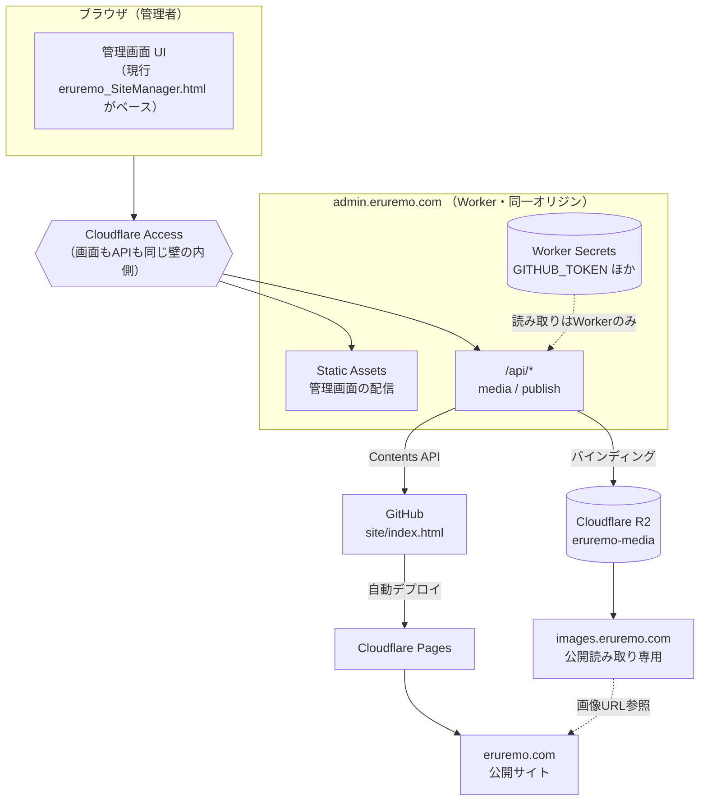

# 将来構成の設計（FUTURE ARCHITECTURE）

作成日：2026-08-05 ／ Phase 1
**状態：設計のみ。今回は一切実装しません。**

> **更新案内**：この文書はPhase 1時点の旧将来案です。Cloudflare PagesとR2カスタムドメインを前提にしたproduction構成は採用せず、現在はPUBLIC/ADMINの2 hostnameと相対`/media/*`を1つのWorkerで扱う[Production Admin Phase A](PRODUCTION_ADMIN_PHASE_A_JA.md)を正とします。次PhaseのD1共有保存候補も同文書に整理しています。

---

## 1. 推奨構成の全体像

| 役割 | ドメイン | 実体 | 認証 |
|---|---|---|---|
| 公開サイト | `https://eruremo.com` | Cloudflare Pages | なし（公開） |
| 管理画面 | `https://admin.eruremo.com` | Cloudflare Worker Static Assets | Cloudflare Access |
| 管理API | `https://admin.eruremo.com/api/*` | **同一 Worker** | Cloudflare Access ＋ JWT検証 |
| 画像配信 | `https://images.eruremo.com/*` | Cloudflare R2（カスタムドメイン） | なし（公開読み取りのみ） |
| ソース | GitHub リポジトリ | `site/index.html` を更新 | Worker Secret のトークン |
| 秘密情報 | — | Cloudflare Worker Secrets | — |



---

## 2. 設計上の判断と、その理由

### 2-1. 管理画面とAPIを同一オリジンにする

**判断：`admin.eruremo.com` が管理画面も `/api/*` も両方を提供する。**

| 理由 | 説明 |
|---|---|
| CORS が不要になる | プリフライトも `Access-Control-Allow-Origin` も一切不要。**設定ミスによる穴が構造的に生まれない** |
| Access の壁が1枚で済む | 画面とAPIを別ドメインにすると、**APIだけ守り忘れる**という最も多い事故が起きる |
| クッキーが自然に共有される | Access のセッションが `/api/*` にもそのまま効く |
| 実装が単純になる | Worker 1つ、`wrangler.toml` 1つ、デプロイ1回 |

**やってはいけない構成**：管理画面を Pages に、APIを別ドメインの Worker に置く。
CORS 設定が必要になり、`Access-Control-Allow-Origin: *` を書いてしまう事故が起きやすくなります。

### 2-2. 不要なCORSを避ける

- 管理API：**同一オリジンなので CORS 設定を書かない**（書く必要がない＝最も安全）
- 画像配信：`` で読むだけなので CORS 不要
  - Canvas で読み込む必要が出た場合のみ、`images.eruremo.com` に限定的な CORS を設定
- `Access-Control-Allow-Origin: *` は**どのエンドポイントでも使わない**

### 2-3. Cloudflare Access で管理画面を保護する

```
❌ ありがちな失敗
  admin.eruremo.com        → Access で保護 ✅
  admin.eruremo.com/api/*  → 保護し忘れ ❌  ← ここから全部やられる

✅ 正しい設定
  admin.eruremo.com/*      → Access で保護（APIを含むすべて）
  さらに Worker 側でも Cf-Access-Jwt-Assertion を検証（多層防御）
```

| 設定 | 内容 |
|---|---|
| 適用範囲 | `admin.eruremo.com/*`（**ワイルドカードで全体**） |
| ポリシー | 特定のメールアドレスのみ許可 |
| ログイン方法 | Google / GitHub / One-time PIN |
| セッション時間 | 24時間程度 |
| Service Token | **作らない**（必要になるまで） |
| バイパスルール | **作らない** |

Worker 側の追加検証：

```
リクエストヘッダ Cf-Access-Jwt-Assertion を検証
  → Cloudflare の公開鍵で署名を確認
  → aud（Application Audience）が一致するか確認
  → email が許可リストにあるか確認
```

Access が何らかの理由で無効化されても、Worker が独立して拒否できます。

### 2-4. GitHubトークンを Worker Secret へ

```
❌ ブラウザに置く
   const TOKEN = "github_pat_xxx"   ← 誰でも読める。リポジトリを乗っ取られる

✅ Worker Secret に置く
   wrangler secret put GITHUB_TOKEN
   → Worker のコードから env.GITHUB_TOKEN で読める
   → ブラウザには絶対に見えない
   → wrangler.toml にも書かれない（Git に入らない）
```

トークンの条件：

| 項目 | 設定 |
|---|---|
| 種類 | Fine-grained personal access token |
| 対象リポジトリ | **公開用リポジトリ1つだけ** |
| 権限 | **Contents: Read and write のみ** |
| 有効期限 | 90日など。期限を設ける |
| 発行者 | **利用者本人**（値をチャットや文書に貼らない） |

### 2-5. ブラウザには秘密情報を置かない

**ブラウザに渡してよいもの／だめなもの**

| ✅ 渡してよい | ❌ 絶対に渡さない |
|---|---|
| 公開画像URL | R2 のアクセスキー／シークレット |
| 操作の成否・エラーメッセージ | GitHub トークン |
| メディア一覧（キー・サイズ・日時） | Cloudflare API トークン |
| 生成した index.html の内容 | Access の Service Token |
| Firebase の apiKey / projectId（※） | — |

※ Firebase の apiKey は仕様上クライアントに露出するもので、秘密鍵ではありません。
実際の防御は Firestore セキュリティルールが担います。

### 2-6. R2 のバケットを直接公開操作させない

| 項目 | 設定 |
|---|---|
| 公開バケット（r2.dev） | **無効**（URLが変わる・制御しにくい） |
| カスタムドメイン | `images.eruremo.com` を設定 |
| 公開書き込み | **絶対に有効化しない** |
| 書き込み経路 | **Worker のバインディング（`env.MEDIA`）のみ** |
| S3互換 API のアクセスキー | **発行しない**（バインディングがあれば不要） |
| 署名付きURL | **使わない**（Worker 経由で十分） |

### 2-7. 画像アップロードは Worker で検証する

**クライアントの申告を一切信用しない**という原則で設計します。

| 検証項目 | 方法 |
|---|---|
| ファイルサイズ | `Content-Length` ＋ 実バイト数の両方（10MB上限） |
| MIME タイプ | **マジックバイト（ファイル先頭）で判定**。ヘッダは参考程度 |
| 許可形式 | `image/jpeg` / `image/png` / `image/webp` のみ |
| SVG | **拒否** |
| 保存キー | **Worker が生成**（クライアントからパスを受け取らない） |
| レスポンスヘッダ | `X-Content-Type-Options: nosniff` |

詳細は `PHASE2_R2_SPEC_JA.md` を参照。

### 2-8. R2 画像削除は安全なキーだけ許可する（Phase 4）

```js
/* すべての読み書き削除で、この1つの正規表現を通す */
const KEY_RE = /^media\/\d{4}\/\d{2}\/[a-f0-9]{16}\.(jpg|png|webp)$/;
```

| 防ぐもの | 方法 |
|---|---|
| パストラバーサル（`../`） | 正規表現に完全一致しないものを拒否 |
| URLエンコード迂回（`%2e%2e`） | デコード後に検証 |
| 絶対パス（先頭 `/`） | 正規表現で拒否 |
| プレフィックス外への操作 | `media/` 固定を正規表現に含める |
| 誤削除 | `trash/` へコピーしてから元を削除（復元可能に） |
| 使用中画像の削除 | `DATA` を走査して使用中なら拒否 |

### 2-9. 公開サイトは静的HTMLを維持する

**判断：`eruremo.com` は Pages が配信する静的ファイルのみ。動的処理を持たせない。**

| 理由 |
|---|
| 攻撃面が最小になる（サーバ側のコードがないので脆弱性が生まれない） |
| 表示が最速になる（エッジキャッシュがそのまま効く） |
| コストがほぼゼロ |
| **現在の「1ファイルで完結する index.html」という強みをそのまま活かせる** |
| 障害時も、ファイルさえあればどこにでも置き直せる |

掲示板だけは動的な要素を持ちますが、これはクライアントから Firebase を直接呼ぶ構成なので、
公開サイト自体は静的なままです。

### 2-10. 現在の単一 index.html 生成方式を維持する

**`buildHtml()` の「テンプレート＋8つの差し込み口」という方式は変更しません。**

| 変わるもの | 変わらないもの |
|---|---|
| `__SITE_DATA__` に入る画像の値が data URL から URL になる | プレースホルダの名前と個数 |
| 生成HTMLのサイズが数MB → 数十KB になる | `const SITE_DATA = …;` ＋ `SITE_DATA_END` の目印 |
| — | CSS・JS が単一HTMLに入っていること |
| — | ダブルクリックで開けること |

これにより、**過去に保存した index.html からの読み込みが将来も動き続けます。**

### 2-11. 将来コードを分割しても、最終成果物は単一HTMLにできる構成

開発しやすさと成果物の性質は、分けて考えます。

```
【開発時（将来）】                    【ビルド後（常に）】

src/
├─ editor/
│   ├─ index.html      UI骨格
│   ├─ style.css
│   ├─ schema.js       SCHEMA定義
│   ├─ storage.js      persist / migrate
│   ├─ history.js      Undo/Redo
│   ├─ image.js        shrinkImage / uploadToR2      ─→  eruremo_SiteManager.html
│   ├─ build.js        buildHtml                          （単一ファイル）
│   └─ checks.js       runChecks
├─ template/
│   └─ site.html       公開サイトのひな形            ─→  Base64 化して埋め込み
└─ data/
    └─ default.json    初期データ                    ─→  Base64 化して埋め込み

worker/
└─ index.js            Worker（分割したまま。埋め込まない）
```

ビルドの条件：

| 条件 | 理由 |
|---|---|
| **外部パッケージを使わない**（Node.js の標準機能のみ） | 現在の「依存ゼロ」という強みを維持する |
| ビルド結果が現在と同じ構造になる | `legacy/` の元ファイルと diff で比較できる |
| ビルドせずとも元ファイルが常に動く | `legacy/eruremo_SiteManager_original.html` はいつでも使える |

**この分割は Phase 2〜5 では行いません。** 必要性が明確になってから、Phase 8 以降で検討します。

### 2-12. 既存プロジェクトJSONとの互換性を維持する

| 保証すること |
|---|
| Phase 1 で書き出した `.json` が、すべての将来Phaseで読み込める |
| `migrate()` の「足りないキーを足すだけ」という非破壊方針を変えない |
| `DATA` のキー名を変更・削除しない |
| localStorage キー `elremo_editor_data_v9` を変更しない（変える場合は旧キーからの読み込みを残す） |

### 2-13. Base64画像とURL画像の両方を、移行期間中は読めるようにする

これは**追加実装が不要**です。理由：

| 場所 | 実装 | 結果 |
|---|---|---|
| エディタのサムネ | `th.style.backgroundImage = url("…")` | どちらも表示できる |
| 生成サイトの画像 | `n.src = v` / `im.src = m.photo` | どちらも表示できる |
| `toUrlMode()` | `v.startsWith("data:image/")` で判定 | URL は自動的に対象外になる |
| `runChecks()` | `String(...).startsWith("data:")` の前例あり | 同じ書き方でチェックを足せる |

**現在のコードは、すでに両対応の設計になっています。**
Phase 2 で「どちらを新規保存するか」の分岐を足すだけで、互換性は自然に保たれます。

---

## 3. ディレクトリ構成（将来の想定）

```
<project-root>\
├─ eruremo_SiteManager.html     ← 管理ツール本体（現在も将来も、これが動く）
├─ legacy/
│   └─ eruremo_SiteManager_original.html   ← Phase 1 のバックアップ（変更禁止）
├─ docs/
│   ├─ CURRENT_ARCHITECTURE_JA.md
│   ├─ PHASE_PLAN_JA.md
│   ├─ TEST_PLAN_JA.md
│   ├─ BEGINNER_GUIDE_JA.md
│   ├─ PHASE2_R2_SPEC_JA.md
│   └─ FUTURE_ARCHITECTURE_JA.md
├─ worker/                       ← Phase 2 で追加
│   └─ index.js
├─ wrangler.toml                 ← Phase 2 で追加
├─ .dev.vars.example             ← Phase 2 で追加（値は空）
├─ .dev.vars                     ← ローカルのみ。Git 対象外
├─ .gitignore
└─ backup/                       ← 利用者の .json 置き場。Git 対象外
```

公開用リポジトリ（別リポジトリ）：

```
eruremo-site/
└─ site/
    └─ index.html                ← Worker が更新し、Pages が配信する
```

**管理ツールと公開サイトを別リポジトリにする理由**：
公開リポジトリは Pages が読むので、**管理ツールのソースを一緒に置かない**ほうが安全です。

---

## 4. API 設計の全体像

すべて `https://admin.eruremo.com` 配下（同一オリジン）。

| メソッド | パス | Phase | 用途 | 備考 |
|---|---|---|---|---|
| `GET` | `/` | 7 | 管理画面（Static Assets） | Access で保護 |
| `GET` | `/api/health` | 2 | 疎通確認 | R2 が使えるか |
| `POST` | `/api/media/upload` | 2 | 画像アップロード | キーはサーバが生成 |
| `GET` | `/api/media` | 4 | 画像一覧 | ページング |
| `DELETE` | `/api/media/:key` | 4 | 画像削除 | `KEY_RE` で検証・`trash/` へ移動 |
| `POST` | `/api/publish` | 5 | GitHub へ公開 | パスは Worker 内にハードコード |

### 共通のレスポンス形式

```json
成功: { "ok": true,  ...データ }
失敗: { "ok": false, "error": { "code": "...", "message": "利用者向けの説明" } }
```

### 共通の検証（すべてのAPI）

1. Cloudflare Access の JWT を検証（Phase 7 以降）
2. `Origin` が `https://admin.eruremo.com` であること（CSRF対策）
3. `Content-Type: application/json` または `multipart/form-data`（単純リクエストにしない）
4. ボディサイズの上限
5. エラー本文に内部情報を含めない

---

## 5. 秘密情報の管理方針

| 情報 | 保管場所 | 誰が設定するか |
|---|---|---|
| R2 へのアクセス | **Worker バインディング**（キー不要） | `wrangler.toml` に記述（秘密ではない） |
| GitHub トークン | **Worker Secret** `GITHUB_TOKEN` | 利用者が `wrangler secret put` |
| 画像の公開ベースURL | `wrangler.toml` の `[vars]` | 秘密ではない |
| Access のポリシー | Cloudflare ダッシュボード | 利用者 |
| Firebase の apiKey | 生成HTMLに埋め込み（仕様どおり） | 利用者が管理画面で入力 |
| プレゼントの合言葉 | ⚠ `DATA` に平文。生成HTMLには暗号化して出る | 利用者が管理画面で入力 |

### 絶対に守るルール

1. **秘密情報を HTML・JS・localStorage・.json・Git に入れない**
2. `.dev.vars` / `.env` は `.gitignore` 済み。`*.example` には**キー名だけ**書く
3. トークンの値を、チャット・文書・スクリーンショットに貼らない
4. トークンには有効期限を設け、定期的に入れ替える
5. 万一漏れたら、**即座に失効させてから**新しく発行する

---

## 6. 移行時に必ず起きる注意点

| # | 事象 | 対策 |
|---|---|---|
| 1 | **`admin.eruremo.com` に移すと localStorage が引き継がれない** | 移行前に `.json` を書き出し、移行後に読み込む。**手順を必須化する** |
| 2 | ローカル版とサーバ版で内容がずれる | どちらを「正」とするか運用で決める |
| 3 | R2 の孤児ファイルが溜まる | Phase 4 のメディア管理で「未使用」を一覧・整理 |
| 4 | 「更新したのに古いページが出る」 | `index.html` は `max-age=0, must-revalidate`。手順書にキャッシュクリアを明記 |
| 5 | OGP のサムネイルが古いまま | X / Discord 側のキャッシュ。各社のデバッガでリフレッシュ |
| 6 | DNS 反映に時間がかかる | 最大48時間 |
| 7 | Access のセッション切れで編集内容が消える不安 | localStorage は残るので消えない。ログインし直せばよい |
| 8 | `file://` 版が使えなくなる不安 | `legacy/` のファイルはいつでも使える |

---

## 7. この構成を選ばなかった代替案と、その理由

| 代替案 | 採用しない理由 |
|---|---|
| 管理画面も Pages に置く | Pages は静的配信専用。API を持てず、結局 Worker が別ドメインになり CORS が必要になる |
| API を別ドメイン（`api.eruremo.com`）に置く | CORS が必要になり、Access の設定漏れリスクが増える |
| ブラウザから R2 に直接アップロード（署名付きURL） | 署名の発行にどのみち Worker が要る。検証をサーバ側で行えず、MIME 偽装を防げない |
| GitHub Actions で公開 | Worker より遅く、トークン管理が分散する。Pages の自動デプロイで十分 |
| 公開サイトを動的にする（SSR） | 攻撃面が増え、コストも上がる。**現在の単一HTMLの強みを捨てることになる** |
| 編集データを最初からサーバに置く | Phase が大きくなりすぎる。localStorage ＋ `.json` で当面は足りる |
| 全面書き換え（フレームワーク導入） | 既存の暗黙の結合をすべて踏み抜く。依存ゼロという強みも失う |

---

## 8. 実現までのロードマップ（要約）

```
Phase 1 ✅  解析・バックアップ・Git・設計          ← いまここ
Phase 2     R2 アップロード（新規画像）
Phase 3     既存 Base64 の一括移行
Phase 4     メディア管理画面
Phase 5     Worker 経由の GitHub 公開
Phase 6     Cloudflare Pages ＋ eruremo.com
Phase 7     admin.eruremo.com ＋ Cloudflare Access
──────────────────────────────────────────
Phase 8+    （必要なら）ソース分割・自動テスト・掲示板の移行
```

詳細は `PHASE_PLAN_JA.md` を参照してください。
