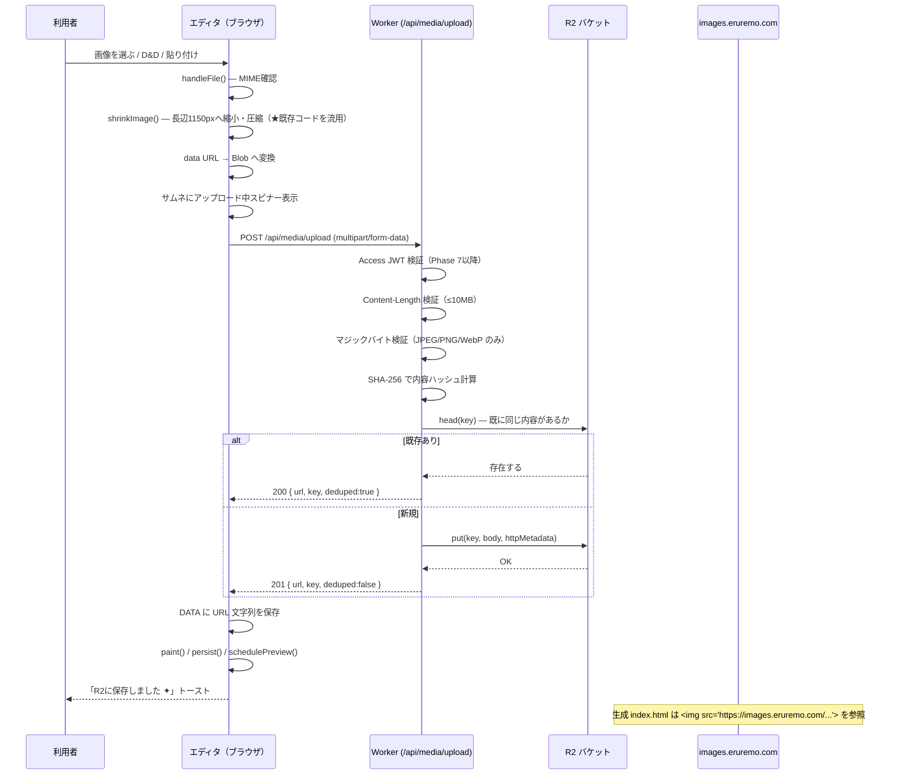
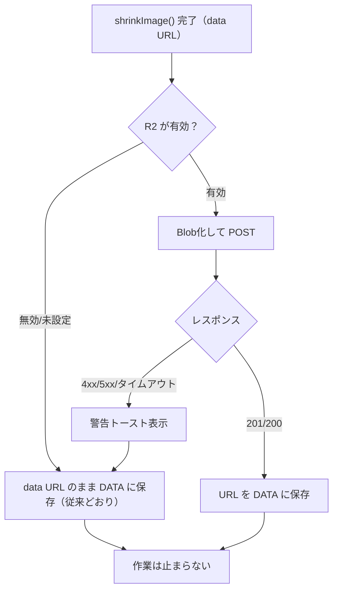

# Phase 2 実装仕様書 ― Cloudflare R2 画像アップロード

作成日：2026-08-05
状態：**設計のみ。Phase 1 では実装しません。**

## 0. この文書の位置づけ

Phase 2 で「新しく追加する画像を Cloudflare R2 に保存し、`DATA` にはURLだけを持たせる」ための設計書です。
既存の Base64 画像の一括移行は Phase 3 で扱います。

### Phase 2 のスコープ

| 含む | 含まない |
|---|---|
| 新規アップロードの R2 保存 | 既存 Base64 の一括移行（Phase 3） |
| アップロード用 Worker API | メディア一覧・削除API（Phase 4） |
| フォールバック（Base64維持） | GitHub公開（Phase 5） |
| チェック項目の追加 | 独自ドメイン公開（Phase 6） |
| ローカル開発環境（`wrangler dev`） | **本番デプロイ** |

### 設計の大原則

1. **既存の動作を壊さない。** R2 が使えなくても、いままでどおり Base64 で動く。
2. **ブラウザに秘密情報を置かない。** R2 の鍵は Worker のバインディング経由のみ。
3. **サーバを信用の起点にする。** MIME もサイズもキーも、Worker 側で決め直す。
4. **既存の URL 手入力機能を残す。** R2 以外のURLも使えたままにする。
5. **`buildHtml()` / `migrate()` / `History` / `SCHEMA` の構造には触らない。**

---

## 1. 全体設計

### 1-1. アップロードの流れ



### 1-2. 失敗時（フォールバック）



**重要**：どのような失敗でも、**利用者の作業を止めない**。必ず Base64 に落ちて続行できること。

---

## 2. Worker API 仕様

### 2-1. エンドポイント一覧

| メソッド | パス | Phase | 用途 |
|---|---|---|---|
| `POST` | `/api/media/upload` | **2** | 画像をアップロード |
| `GET` | `/api/media` | 4 | 画像一覧 |
| `DELETE` | `/api/media/:key` | 4 | 画像削除 |
| `GET` | `/api/health` | 2 | R2が使えるかの疎通確認 |

Phase 2 で実装するのは **`POST /api/media/upload`** と **`GET /api/health`** の2つだけです。

---

### 2-2. `POST /api/media/upload`

#### リクエスト

```
POST /api/media/upload HTTP/1.1
Host: admin.eruremo.com
Content-Type: multipart/form-data; boundary=----XXXX

------XXXX
Content-Disposition: form-data; name="file"; filename="blob"
Content-Type: image/webp

<バイナリ>
------XXXX
Content-Disposition: form-data; name="hint"

cast.members.0.photo
------XXXX--
```

| フィールド | 必須 | 型 | 説明 |
|---|---|---|---|
| `file` | ✅ | Blob | 画像本体。**クライアント側で圧縮済みのもの** |
| `hint` | — | string | どの項目の画像か（**ログ用のみ。キー生成には一切使わない**） |

**クライアントからパス・ファイル名・キーを受け取りません。** すべて Worker が決めます。

#### レスポンス（成功）

```json
{
  "ok": true,
  "key": "media/2026/08/3f2a9c1b7e4d8a05.webp",
  "url": "https://images.eruremo.com/media/2026/08/3f2a9c1b7e4d8a05.webp",
  "size": 84213,
  "contentType": "image/webp",
  "deduped": false
}
```

| ステータス | 意味 |
|---|---|
| `201 Created` | 新規アップロード成功 |
| `200 OK` | 同一内容が既に存在（`deduped: true`）。**アップロードはスキップ** |

#### レスポンス（エラー）

```json
{
  "ok": false,
  "error": {
    "code": "UNSUPPORTED_TYPE",
    "message": "この形式の画像には対応していません（JPEG / PNG / WebP のみ）",
    "detail": "sniffed=image/svg+xml"
  }
}
```

| HTTP | `code` | 利用者向けメッセージ |
|---|---|---|
| 400 | `NO_FILE` | ファイルが送られてきませんでした |
| 400 | `EMPTY_FILE` | ファイルが空です |
| 400 | `UNSUPPORTED_TYPE` | この形式の画像には対応していません（JPEG / PNG / WebP のみ） |
| 400 | `MIME_MISMATCH` | ファイルの中身と種類が一致しません |
| 401 | `UNAUTHORIZED` | ログインが必要です |
| 413 | `TOO_LARGE` | 画像が大きすぎます（最大10MB） |
| 415 | `BAD_CONTENT_TYPE` | multipart/form-data で送ってください |
| 429 | `RATE_LIMITED` | 少し時間をおいてからおためしください |
| 500 | `R2_ERROR` | 保存に失敗しました。もう一度おためしください |
| 503 | `R2_UNAVAILABLE` | 画像の保管庫に接続できませんでした |

**エラー本文に、内部パス・バケット名・トークン・スタックトレースを含めないこと。**

---

### 2-3. `GET /api/health`

エディタ起動時に1回だけ叩き、R2 モードが使えるかを判定します。

```json
{ "ok": true, "r2": true, "publicBase": "https://images.eruremo.com", "maxBytes": 10485760 }
```

- 応答なし・`ok:false`・タイムアウト（3秒）→ **埋め込みモード（Base64）で起動**
- この結果は `sessionStorage` に保存し、リロードごとに1回だけ確認する

---

## 3. 検証仕様（Worker 側・**クライアントを信用しない**）

### 3-1. 最大サイズ

| 項目 | 値 |
|---|---|
| リクエスト全体 | 12 MB |
| ファイル1件 | **10 MB**（`MAX_UPLOAD_BYTES`） |

- `Content-Length` で事前拒否 → ストリーム読み取り中も累積バイト数を監視
- 実運用では `shrinkImage()` 通過後なので通常 100〜300KB。10MB は保険

### 3-2. 許可 MIME タイプ

| MIME | 拡張子 | 可否 |
|---|---|---|
| `image/jpeg` | `.jpg` | ✅ |
| `image/png` | `.png` | ✅ |
| `image/webp` | `.webp` | ✅ |
| `image/gif` | — | ❌（アニメーションは今回対象外） |
| `image/avif` | — | ❌（将来検討） |
| **`image/svg+xml`** | — | **❌ 拒否** |
| その他すべて | — | ❌ |

### 3-3. マジックバイト検証（**必須**）

`Content-Type` ヘッダは**信用しません**。ファイル先頭のバイト列で判定します。

| 形式 | 先頭バイト |
|---|---|
| JPEG | `FF D8 FF` |
| PNG | `89 50 4E 47 0D 0A 1A 0A` |
| WebP | `52 49 46 46` (RIFF) ＋ 8バイト目から `57 45 42 50` (WEBP) |

判定結果と申告 `Content-Type` が食い違う場合は `MIME_MISMATCH` で拒否。
**保存時の `httpMetadata.contentType` は、判定結果の方を採用します。**

### 3-4. SVG の扱い

**Phase 2 では完全に拒否します。**

理由：SVG は XML なので `<script>` を含められます。
`images.eruremo.com/xxx.svg` を直接ブラウザで開かれると、**そのドメイン上でスクリプトが実行**され得ます。
`` 経由なら実行されませんが、URLを直接開くのを防ぐ手段がありません。

将来どうしても必要になった場合の条件（Phase 4以降で検討）：

- 別バケット・別サブドメインに隔離する
- `Content-Disposition: attachment` を付ける
- 厳格な CSP（`script-src 'none'`）を返す
- サニタイズ（DOMPurify 相当の処理）を通す

なお現状のエディタでは、`shrinkImage()` が Canvas を経由するため
**SVG を選んでもラスタ画像に変換されます**。実質的に SVG が Worker に届くのは、
URL手入力欄に `data:image/svg+xml` を直接貼った場合のみです。

---

## 4. 画像圧縮とBlob生成（クライアント側）

### 4-1. 既存 `shrinkImage()` をそのまま使う

**新しい圧縮ロジックを書きません。** 既存の実装（1440–1476行）は十分に良くできています。

```
FileReader → Image → Canvas（長辺1150px）
 → 透過あり : PNG ＋ WebP(0.92)
 → 透過なし : JPEG(0.80) ＋ WebP(0.82)
 → いちばん短い候補を採用
```

### 4-2. data URL → Blob 変換

既存の `dataUrlToBytes()`（1729行）が使えます。**新規実装は不要です。**

```js
/* 既存の dataUrlToBytes() を利用した最小の追加関数 */
function dataUrlToBlob(u){
  const mime = (/^data:([^;,]+)/.exec(u) || [,"application/octet-stream"])[1];
  return new Blob([dataUrlToBytes(u)], {type: mime});
}
```

### 4-3. 変更する箇所（最小限）

現在の `handleFile()`（862–871行）に、保存先の分岐だけを足します。

```
【現在】
  handleFile(f)
    → shrinkImage(f) で data URL を得る
    → curVal = url; paint(url); onChange(url)

【Phase 2 後】
  handleFile(f)
    → shrinkImage(f) で data URL を得る          ← 変更なし
    → if (R2モード有効) {
         スピナー表示
         try   { url = await uploadToR2(dataUrl) }   ← 追加
         catch { 警告トースト（data URL のまま続行） }
         finally { スピナー解除 }
       }
    → curVal = url; paint(url); onChange(url)   ← 変更なし
```

**`onChange` から先の流れ（`typed()` / `persist()` / プレビュー更新）は一切変更しません。**

---

## 5. R2 キー生成と公開URL

### 5-1. キーの形式

```
media/{YYYY}/{MM}/{contentHash16}.{ext}

例：media/2026/08/3f2a9c1b7e4d8a05.webp
```

| 部分 | 生成方法 |
|---|---|
| `media/` | 固定プレフィックス（**Worker内でハードコード**） |
| `{YYYY}/{MM}` | Worker 側の現在時刻（UTC）から生成 |
| `{contentHash16}` | ファイル内容の SHA-256 の**先頭16桁（hex）** |
| `{ext}` | **マジックバイト判定の結果**から決定（`jpg` / `png` / `webp`） |

**クライアントから受け取った文字列は、キーに一切含めません。**
これによりパストラバーサル（`../` による意図しない場所への書き込み）が構造的に不可能になります。

### 5-2. 検証用の正規表現

Phase 4 の削除APIでも使う、共通の検証パターン：

```js
const KEY_RE = /^media\/\d{4}\/\d{2}\/[a-f0-9]{16}\.(jpg|png|webp)$/;
```

この正規表現に**完全一致しないキーは、読み書き削除すべて拒否**します。

### 5-3. 重複検出

- 内容の SHA-256 が同じ → 同じキーになる → **自動的に重複排除される**
- `put()` の前に `bucket.head(key)` で存在確認し、あれば `200 { deduped: true }` を返す
- 同じ写真を何度アップロードしても R2 の使用量は増えません
- 既存の `toUrlMode()` も `seen` Map で同様の重複排除をしており、**考え方が一貫しています**

### 5-4. 公開URL

```
https://images.eruremo.com/{key}
```

- R2 バケットにカスタムドメイン `images.eruremo.com` を設定
- **バケットの「公開バケット（r2.dev）」機能は使わない**（URLが変わる・制御しにくい）
- 書き込みは Worker バインディング経由のみ。**公開書き込みは絶対に有効化しない**

### 5-5. キャッシュ設定

| 対象 | ヘッダ |
|---|---|
| 画像（内容ハッシュ入り＝実質不変） | `Cache-Control: public, max-age=31536000, immutable` |
| すべての画像レスポンス | `X-Content-Type-Options: nosniff` |
| `Content-Type` | **マジックバイト判定の結果**を設定 |

内容が変われば必ずキーも変わるため、キャッシュを1年にしても古い画像が出る問題は起きません。

---

## 6. エディタ側UIの変更

### 6-1. アップロード中の表示

| 要素 | 変更 |
|---|---|
| サムネイル（`.thumb`） | 半透明＋スピナーを重ねる（CSSクラス `.uploading` を追加） |
| 「🖼 画像をえらぶ」ボタン | `disabled` にする |
| トースト | 「画像をアップロードしています…」 |
| 完了時 | 「R2に保存しました ✦ 84 KB」 |
| 重複時 | 「同じ画像がすでにありました ✦」 |
| 失敗時 | 「アップロードに失敗しました。埋め込み画像として保存します」（warn） |

### 6-2. 保存先の表示

画像フィールドに、現在の保存方式が分かる小さなバッジを出します。

| 値の形 | バッジ | 色 |
|---|---|---|
| `data:` で始まる | `埋め込み 84KB` | 黄（`--warn`） |
| `https://images.eruremo.com/...` | `R2` | 緑（`--ok`） |
| その他の `http(s)://` | `外部URL` | 灰（`--dim`） |
| `photos/...` などの相対パス | `相対パス` | 灰 |
| 空 | 表示なし | — |

### 6-3. ギャラリー一括追加

- 同時実行数を **3件** に制限（`Promise` のプール）
- 進捗トースト：「3 / 12 枚をアップロード中…」
- 失敗した画像は data URL のまま追加し、完了後に「◯枚は埋め込みのままです」と通知

### 6-4. URL手入力欄（**変更しない**）

既存の `.urlin` は**そのまま維持**します。

- R2 以外のURLも使えたまま
- `photos/01.jpg` のような相対パスも使えたまま
- ここに入力した値は**アップロードを経由しません**（従来どおり）

---

## 7. 既存機能との関係

### 7-1. 既存の URL 手入力機能との共存

| 入力方法 | Phase 2 後の挙動 |
|---|---|
| 「画像をえらぶ」 | R2 有効 → R2 URL ／ 無効・失敗 → data URL |
| ドラッグ＆ドロップ | 同上 |
| クリップボード貼り付け | 同上 |
| まとめて追加 | 同上（同時3件） |
| **URL手入力** | **変更なし。入力した文字列がそのまま入る** |

生成サイト側は `n.src = v` / `im.src = m.photo` としているだけなので、
**data URL・絶対URL・相対パスのどれでもそのまま動きます。** これが共存できる理由です。

### 7-2. 既存 Base64 データとの互換性

**両方を読める状態を維持します。**

| 場面 | 挙動 |
|---|---|
| 起動時に既存 data URL を読む | そのまま表示・保存・書き出しできる |
| 既存 data URL の項目を編集 | 触らなければ data URL のまま |
| 既存 data URL の画像を差し替え | 新しい画像だけ R2 になる |
| Phase 1 で書き出した `.json` の読み込み | **そのまま読める**（`migrate()` は変更しない） |
| Phase 1 で書き出した `index.html` の読み込み | **そのまま読める**（`SITE_DATA` の目印は変更しない） |
| 生成 index.html | data URL と R2 URL が混在していても正しく表示される |

**`migrate()` には手を加えません。** URLか data URL かは値の見た目で判別できるため、
データ構造の変更もバージョン番号の変更も不要です。

### 7-3. Undo / Redo との関係

| 論点 | 方針 |
|---|---|
| 履歴に積むタイミング | 現状どおり `onChange` → `typed()`。**アップロード完了後**に値が確定するので自然に整合する |
| アップロード中に Ctrl+Z | 完了後に古い値へ戻る。**R2 側にはファイルが残る**（孤児ファイル） |
| 孤児ファイル | **Phase 2 では許容する。** Phase 4 のメディア管理で「未使用」として一覧・削除できるようにする |
| 履歴のメモリ | URL文字列は data URL より遥かに短く、`clone()` の文字列共有と合わせて**むしろ軽くなる** |
| `History.MAX = 60` | 変更しない |

**アップロード中の操作をブロックしない**方針とします（作業を止めないことを優先）。

### 7-4. localStorage との関係

| 項目 | Phase 2 後 |
|---|---|
| 保存キー `elremo_editor_data_v9` | **変更しない** |
| 保存内容 | 新規画像がURLになるぶん**小さくなる**（1枚あたり約 100KB → 約 60バイト） |
| `QUOTA_SOFT = 4.2MB` | 変更しない（Phase 3 完了後に見直してもよい） |
| 容量メーター | 変更しない。数値が自然に下がる |
| `sessionStorage` | R2 の疎通確認結果のキャッシュに**新規に使用**（キー：`elremo_r2_health`） |

### 7-5. JSON書き出しとの関係

| 項目 | Phase 2 後 |
|---|---|
| ファイル名 | `elremo-project.json`（日付付与は任意の改善候補） |
| 中身 | URL文字列が入るだけ。**構造は完全に同じ** |
| サイズ | 大幅に小さくなる |
| 旧 `.json` の読み込み | **そのまま読める** |
| ⚠ 合言葉の平文 | **現状のまま入る。** `README.md` の「セキュリティ上の注意」を参照 |

### 7-6. index.html 生成との関係

**`buildHtml()` は一切変更しません。**

- `__SITE_DATA__` に入る JSON の中身が data URL から URL 文字列に変わるだけ
- テンプレート側は `n.src = v` なので変更不要
- 生成HTMLのサイズが劇的に小さくなる（数MB → 数十KB）
- ⚠ **`seo.ogImage` は元々URL必須**なので影響なし
- ⚠ **`seo.favicon` は data URL でも動く**（`<link rel="icon" href="data:...">`）。R2 URL でも動く

### 7-7. `toUrlMode()`（zip方式）との関係

**残します。削除しません。**

- インターネットに繋がらない環境や、Cloudflare を使わない配布形態のための逃げ道として価値がある
- Phase 2 後は「data URL のもの**だけ**」が変換対象になる（R2 URL は `startsWith("data:image/")` で除外される＝**現在の実装のままで正しく動く**）

---

## 8. セキュリティ対策のまとめ

| # | 対策 | 実装場所 |
|---|---|---|
| S-1 | R2 のアクセスキーをブラウザに置かない | Worker のバインディング（`env.MEDIA`） |
| S-2 | MIME をマジックバイトで再検証 | Worker |
| S-3 | SVG を拒否 | Worker |
| S-4 | 最大サイズを強制（10MB） | Worker |
| S-5 | キーをサーバ側で生成（パストラバーサル不可） | Worker |
| S-6 | キー形式を正規表現で検証 | Worker（`KEY_RE`） |
| S-7 | `X-Content-Type-Options: nosniff` | R2 レスポンス |
| S-8 | 公開書き込みを無効化 | R2 バケット設定 |
| S-9 | 管理画面とAPIを同一オリジンに（CORS不要） | Worker のルーティング |
| S-10 | `Origin` / `Sec-Fetch-Site` を検証（CSRF対策） | Worker |
| S-11 | エラー本文に内部情報を含めない | Worker |
| S-12 | 秘密情報を Git に入れない | `.gitignore`（Phase 1 で作成済み） |
| S-13 | Cloudflare Access で保護 | Phase 7 |
| S-14 | レート制限 | Worker（簡易なもので可） |

### `.dev.vars` の扱い

- `.gitignore` に登録済み（Phase 1 で対応）
- **`.dev.vars.example` にはキー名だけを書き、値は絶対に書かない**

```
# .dev.vars.example ― これはコミットしてよいファイル（値は空のまま）
# 実際の値は .dev.vars に書く。.dev.vars は絶対にコミットしない。
MEDIA_PUBLIC_BASE=
```

R2 のバインディングは `wrangler.toml` に書きます（**バインディング名とバケット名だけなので秘密ではありません**）。

```toml
# wrangler.toml（例・Phase 2 で作成）
name = "your-worker-name"
main = "worker/index.js"
compatibility_date = "2026-01-01"

[[r2_buckets]]
binding = "MEDIA"
bucket_name = "eruremo-media"

[vars]
MEDIA_PUBLIC_BASE = "https://images.eruremo.com"
MAX_UPLOAD_BYTES = "10485760"
```

---

## 9. テスト項目

### 9-1. Worker 単体

| # | 項目 | 期待 |
|---|---|---|
| W-1 | 正常なJPEGをアップロード | 201、正しいURLが返る |
| W-2 | 正常なPNG | 201 |
| W-3 | 正常なWebP | 201 |
| W-4 | 同じ画像を2回 | 2回目は 200 ＋ `deduped:true`、キーが同一 |
| W-5 | **SVGをアップロード** | **400 `UNSUPPORTED_TYPE`** |
| W-6 | GIFをアップロード | 400 |
| W-7 | **拡張子だけ .jpg にしたテキスト** | **400 `MIME_MISMATCH`** |
| W-8 | **Content-Type を image/jpeg と偽ったSVG** | **400（マジックバイトで検出）** |
| W-9 | 11MBのファイル | 413 `TOO_LARGE` |
| W-10 | 空ファイル | 400 `EMPTY_FILE` |
| W-11 | `file` フィールドなし | 400 `NO_FILE` |
| W-12 | `hint` に `../../etc/passwd` | **無視され、正常なキーが生成される** |
| W-13 | `hint` を省略 | 正常に動く |
| W-14 | 生成キーが `KEY_RE` に一致 | 全ケースで一致 |
| W-15 | Origin が異なるリクエスト | 403 |
| W-16 | `/api/health` | `{ok:true, r2:true}` |
| W-17 | エラー本文に内部情報が無い | バケット名・パス・スタックが含まれない |

### 9-2. エディタ側

`TEST_PLAN_JA.md` の「Phase 2 確認項目（P2-1〜P2-16）」を全実施。特に：

| # | 項目 | 期待 |
|---|---|---|
| E-1 | **R2 を止めた状態で画像を選ぶ** | **従来どおり Base64 で保存され、作業が止まらない** |
| E-2 | アップロード中の表示 | スピナーが出て、完了後に消える |
| E-3 | 失敗時の復元 | 元の画像が壊れず、警告トーストが出る |
| E-4 | 既存 Base64 画像 | そのまま表示・保存・書き出しできる |
| E-5 | URL手入力 | 従来どおり動く |
| E-6 | Phase 1 の `.json` | 読み込める |
| E-7 | Phase 1 の `index.html` | 読み込める |
| E-8 | 生成 index.html | R2 URL が `` に入る |
| E-9 | ブラウザに秘密情報がない | DevTools の Network / Application で確認 |
| E-10 | Undo / Redo | 壊れていない |
| E-11 | 一括追加12枚 | 同時3件で処理され、進捗が出る |
| E-12 | `toUrlMode()` | data URL のものだけ変換される |

### 9-3. 回帰テスト

`TEST_PLAN_JA.md` の 1〜10章を**全項目実施**。Phase 1 と同じ結果になること。

---

## 10. ロールバック方法

### 10-1. コード（エディタ側）

| 手段 | 手順 |
|---|---|
| **推奨** | `git revert <Phase2のコミット>` または `git checkout phase-1 -- eruremo_SiteManager.html` |
| 緊急 | `legacy/eruremo_SiteManager_original.html` をコピーして使う |

### 10-2. データ

**R2 に保存した画像URLは、`DATA` の中では「ただの文字列」です。**
そのため、コードを Phase 1 に戻しても、**URL手入力と同じ扱いで正常に表示されます。**
データの巻き戻しは基本的に不要です。

完全に Base64 に戻したい場合：

1. Phase 2 開始前に書き出した `.json` を読み込む
2. または各画像を選び直す（`shrinkImage()` だけが動き data URL になる）

### 10-3. Worker

| 手段 | 手順 |
|---|---|
| ローカル開発のみ | `wrangler dev` を止めるだけ。エディタは自動で埋め込みモードにフォールバック |
| デプロイ済み | `wrangler rollback` または該当ルートを無効化 |

### 10-4. R2

- **削除は不要。** 残っていても課金は微小で、害はありません
- Phase 4 のメディア管理画面ができてから整理するのが安全です
- **緊急でも `wrangler r2 object delete` を一括で使わないこと**（取り返しがつきません）

### 10-5. ロールバック判断の目安

| 状況 | 判断 |
|---|---|
| アップロードが時々失敗する | フォールバックが効いていれば**続行してよい** |
| 既存画像が表示されなくなった | **即ロールバック** |
| `.json` / `index.html` が読めなくなった | **即ロールバック** |
| Undo が壊れた | **即ロールバック** |
| ブラウザに秘密情報が出た | **即ロールバック＋トークン失効** |

---

## 11. 実装チェックリスト（Phase 2 着手時）

### 事前準備（利用者が実施）

- [ ] `.json` を書き出してバックアップ
- [ ] Git でコミットし、タグ `phase-1` を打つ
- [ ] Cloudflare アカウントを用意
- [ ] R2 バケット `eruremo-media` を作成
- [ ] `images.eruremo.com` のカスタムドメインを設定
- [ ] **バケットの公開書き込みが無効であることを確認**
- [ ] `wrangler login`

### Worker 実装

- [ ] `wrangler.toml`（R2バインディング・vars）
- [ ] `.dev.vars.example`（**値は空**）
- [ ] `GET /api/health`
- [ ] `POST /api/media/upload`
- [ ] マジックバイト検証
- [ ] サイズ制限
- [ ] SHA-256 によるキー生成
- [ ] `head()` による重複検出
- [ ] `Origin` 検証
- [ ] エラーレスポンスの統一
- [ ] `wrangler dev` でのローカル動作確認

### エディタ実装

- [ ] `R2` 疎通確認（起動時1回・`sessionStorage` にキャッシュ）
- [ ] `dataUrlToBlob()` の追加
- [ ] `uploadToR2()` の追加
- [ ] `handleFile()` に保存先分岐を追加
- [ ] アップロード中UI（`.uploading` クラス）
- [ ] 保存先バッジ
- [ ] 一括追加の同時実行制限（3件）
- [ ] `runChecks()` に「埋め込み画像が◯枚残っています」の warn を追加
- [ ] **フォールバックの動作確認**

### 完了確認

- [ ] `TEST_PLAN_JA.md` 1〜10章の全項目
- [ ] `TEST_PLAN_JA.md` P2-1〜P2-16
- [ ] 本文書 9-1（W-1〜W-17）
- [ ] 本文書 9-2（E-1〜E-12）
- [ ] Git でコミットし、タグ `phase-2` を打つ

---

## 付録A：想定される Worker の骨格（**参考。Phase 2 で実装**）

```js
/* worker/index.js ― 骨格のみ。Phase 1 では作成しません。 */

const MAGIC = [
  { type: "image/jpeg", ext: "jpg",  test: b => b[0]===0xFF && b[1]===0xD8 && b[2]===0xFF },
  { type: "image/png",  ext: "png",  test: b => b[0]===0x89 && b[1]===0x50 && b[2]===0x4E && b[3]===0x47 },
  { type: "image/webp", ext: "webp", test: b => b[0]===0x52 && b[1]===0x49 && b[2]===0x46 && b[3]===0x46
                                              && b[8]===0x57 && b[9]===0x45 && b[10]===0x42 && b[11]===0x50 },
];

const KEY_RE = /^media\/\d{4}\/\d{2}\/[a-f0-9]{16}\.(jpg|png|webp)$/;

function err(status, code, message, detail){
  return Response.json({ ok:false, error:{ code, message, ...(detail?{detail}:{}) } }, { status });
}

async function sha256Hex(buf){
  const d = await crypto.subtle.digest("SHA-256", buf);
  return [...new Uint8Array(d)].map(b => b.toString(16).padStart(2,"0")).join("");
}

export default {
  async fetch(request, env){
    const url = new URL(request.url);

    if(url.pathname === "/api/health"){
      return Response.json({ ok:true, r2: !!env.MEDIA,
        publicBase: env.MEDIA_PUBLIC_BASE, maxBytes: Number(env.MAX_UPLOAD_BYTES) });
    }

    if(url.pathname === "/api/media/upload" && request.method === "POST"){
      /* CSRF：同一オリジンからの呼び出しだけを許可 */
      const origin = request.headers.get("Origin");
      if(origin && origin !== url.origin) return err(403, "FORBIDDEN", "許可されていない送信元です");

      const ct = request.headers.get("Content-Type") || "";
      if(!ct.startsWith("multipart/form-data"))
        return err(415, "BAD_CONTENT_TYPE", "multipart/form-data で送ってください");

      const max = Number(env.MAX_UPLOAD_BYTES) || 10485760;
      const len = Number(request.headers.get("Content-Length") || 0);
      if(len > max + 2048) return err(413, "TOO_LARGE", "画像が大きすぎます（最大10MB）");

      const form = await request.formData();
      const file = form.get("file");
      if(!file || typeof file === "string") return err(400, "NO_FILE", "ファイルが送られてきませんでした");

      const buf = await file.arrayBuffer();
      if(buf.byteLength === 0)   return err(400, "EMPTY_FILE", "ファイルが空です");
      if(buf.byteLength > max)   return err(413, "TOO_LARGE", "画像が大きすぎます（最大10MB）");

      /* ★ Content-Type は信用せず、中身で判定する */
      const head = new Uint8Array(buf.slice(0, 16));
      const kind = MAGIC.find(m => m.test(head));
      if(!kind) return err(400, "UNSUPPORTED_TYPE",
        "この形式の画像には対応していません（JPEG / PNG / WebP のみ）");

      /* ★ キーはサーバが決める。クライアントの入力は一切使わない */
      const hash = (await sha256Hex(buf)).slice(0, 16);
      const now  = new Date();
      const key  = `media/${now.getUTCFullYear()}/`
                 + `${String(now.getUTCMonth()+1).padStart(2,"0")}/`
                 + `${hash}.${kind.ext}`;
      if(!KEY_RE.test(key)) return err(500, "R2_ERROR", "保存に失敗しました");

      try{
        const existing = await env.MEDIA.head(key);
        if(!existing){
          await env.MEDIA.put(key, buf, {
            httpMetadata: {
              contentType: kind.type,
              cacheControl: "public, max-age=31536000, immutable",
            },
          });
        }
        return Response.json({
          ok:true, key, url: `${env.MEDIA_PUBLIC_BASE}/${key}`,
          size: buf.byteLength, contentType: kind.type, deduped: !!existing,
        }, { status: existing ? 200 : 201 });
      }catch(e){
        return err(500, "R2_ERROR", "保存に失敗しました。もう一度おためしください");
      }
    }

    return err(404, "NOT_FOUND", "見つかりません");
  }
};
```

## 付録B：想定されるエディタ側の追加（**参考。Phase 2 で実装**）

```js
/* ---- Phase 2 で追加する部分（既存コードは変更しない） ---- */

let R2 = { ok:false, base:"", max:10485760 };

async function checkR2(){
  try{
    const cached = sessionStorage.getItem("elremo_r2_health");
    if(cached) return (R2 = JSON.parse(cached));
  }catch(e){}
  try{
    const ctl = new AbortController();
    const t = setTimeout(()=>ctl.abort(), 3000);
    const r = await fetch("/api/health", {signal: ctl.signal});
    clearTimeout(t);
    const j = await r.json();
    R2 = { ok: !!(j.ok && j.r2), base: j.publicBase || "", max: j.maxBytes || 10485760 };
  }catch(e){
    R2 = { ok:false, base:"", max:10485760 };   /* 失敗＝埋め込みモード */
  }
  try{ sessionStorage.setItem("elremo_r2_health", JSON.stringify(R2)); }catch(e){}
  return R2;
}

function dataUrlToBlob(u){
  const mime = (/^data:([^;,]+)/.exec(u) || [,"application/octet-stream"])[1];
  return new Blob([dataUrlToBytes(u)], {type: mime});   /* 既存関数を再利用 */
}

async function uploadToR2(dataUrl, hint){
  const fd = new FormData();
  fd.append("file", dataUrlToBlob(dataUrl), "blob");
  if(hint) fd.append("hint", hint);
  const r = await fetch("/api/media/upload", { method:"POST", body: fd });
  const j = await r.json();
  if(!r.ok || !j.ok) throw new Error(j?.error?.message || "アップロードに失敗しました");
  return j;   /* { url, key, size, deduped } */
}

/* handleFile() 内の変更（★の行だけを追加する） */
async function handleFile(f){
  if(!f || !/^image\//.test(f.type)) return;
  toast("画像を読み込んでいます…");
  const before = f.size;
  let url = await shrinkImage(f, def.big ? 1500 : 1150);   /* ← 既存のまま */
  if(!url){ toast("この画像は読み込めませんでした","err"); return; }

  if(R2.ok){                                               /* ★ */
    box.classList.add("uploading");                        /* ★ */
    try{                                                   /* ★ */
      const res = await uploadToR2(url, wrap.dataset.key); /* ★ */
      url = res.url;                                       /* ★ */
      toast(res.deduped ? "同じ画像がすでにありました ✦"   /* ★ */
                        : `R2に保存しました ✦ ${fmtSize(res.size)}`);
    }catch(e){                                             /* ★ */
      toast("アップロードに失敗しました。埋め込み画像として保存します","warn",4000);
    }finally{ box.classList.remove("uploading"); }         /* ★ */
  }                                                        /* ★ */

  curVal = url; paint(url); onChange(url);                 /* ← 既存のまま */
  /* …以下、既存のトースト表示 */
}
```

> この差分の考え方が Phase 2 の核心です。
> **既存の処理の「あいだ」に1つ処理を挟むだけで、前後の流れは何も変えません。**
