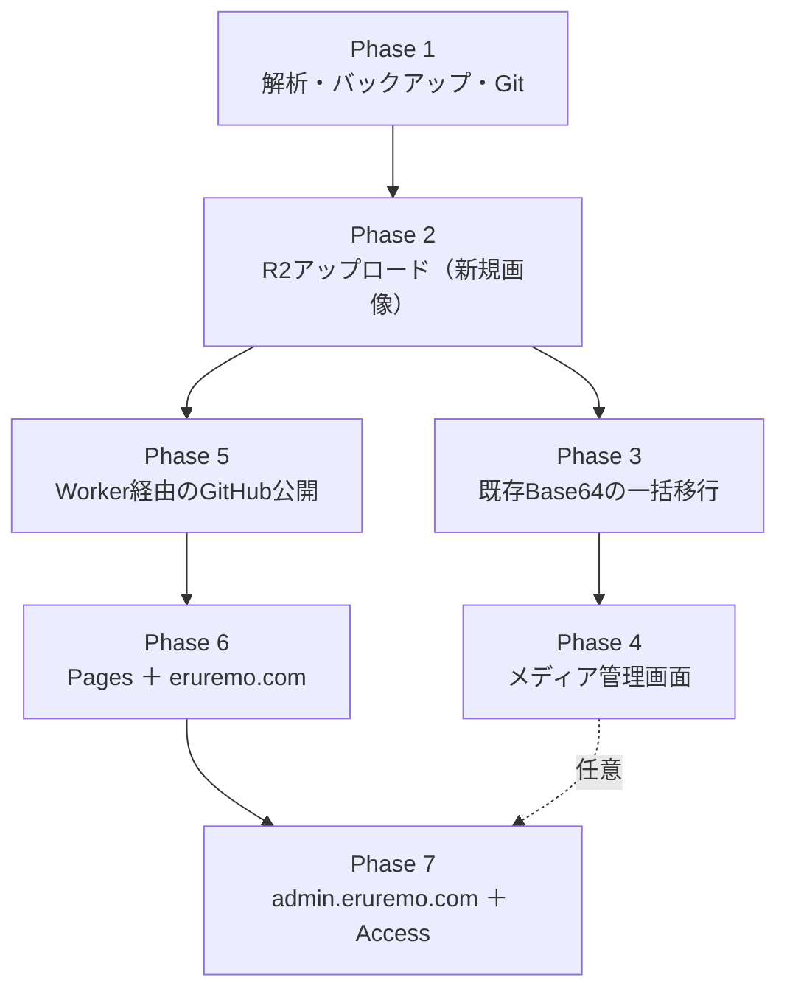

# 段階的移行計画（PHASE PLAN）

対象：改変喫茶えるれも / ERUREMO サイト編集ツール
作成日：2026-08-05

> **現在のproduction方針について**：この文書は初期Phase計画の履歴です。productionの公開サイト・管理画面・`/media/*`を同一Workerの別hostnameで分離する現在のPhase A設計は、[PRODUCTION_ADMIN_PHASE_A_JA.md](PRODUCTION_ADMIN_PHASE_A_JA.md)を正とします。

## 最終的なゴール

| 用途 | ドメイン | 実体 |
|---|---|---|
| 公開サイト | `https://eruremo.com` | Cloudflare Pages（静的な単一 index.html） |
| 管理画面 | `https://admin.eruremo.com` | Cloudflare Worker Static Assets |
| 管理API | `https://admin.eruremo.com/api/*` | 同一 Worker（**同一オリジン**） |
| 画像配信 | `https://images.eruremo.com/*` | Cloudflare R2（カスタムドメイン） |
| 秘密情報 | — | Cloudflare Worker Secrets |
| 認証 | — | Cloudflare Access |

## 全Phaseを通じて守る「変更禁止リスト」

リファクタリングや機能追加のたびに、以下を壊していないか確認してください。

1. localStorage キー **`elremo_editor_data_v9`**（旧キー `elremo_editor_data_v1` の読み込みも維持）
2. `DATA` のキー名（`pageTitle` / `cast.members` / `gallery.items` など既存すべて）
3. 生成HTML内の目印 **`const SITE_DATA = …;`** ＋ 改行 ＋ **`/* ==== SITE_DATA_END`**
4. `TEMPLATE` の8プレースホルダ名（`__PAGE_TITLE__` 〜 `__SITE_DATA__`）
5. プレゼントの `lock` 形式（`btoa(iv 12バイト ++ AES-GCM暗号文)`、鍵は `SHA-256(合言葉)`）
6. 生成サイトの localStorage キー `elremo_board_v1` / `elremo_motion`
7. 生成サイトでテキストを **`textContent`** で流し込む方式（`innerHTML` にしない）
8. `JSON.stringify(...).replace(/<\/script/gi, "<\\/script")` の2箇所
9. **最終成果物は単一 index.html**（CSS・JSを外部ファイルに分離しない）
10. Base64 data URL の画像も**読めるまま**にする（移行期間中の互換性）

---

# Phase 1：現状解析・バックアップ・Git準備・設計 ✅ 完了

### 目的
既存ツールを1行も変えずに、完全に把握し、いつでも戻れる状態を作る。

### 変更対象
- `legacy/`（新規）
- `docs/`（新規）
- `.gitignore`（新規）
- ローカルGitリポジトリ（新規）
- **`eruremo_SiteManager.html` は変更なし**

### 実装内容
- 全2,016行＋Base64埋め込み2件（TEMPLATE / DEFAULT_DATA）の解析
- `legacy/eruremo_SiteManager_original.html` へのバックアップ（SHA-256一致確認済み）
- 本ドキュメント群の作成
- ローカルGit初期化と初回コミット

### セキュリティ対策
- APIキー・トークン・秘密鍵を一切作成・保存していない
- 外部サービスへの接続なし、GitHubへのpushなし、remote登録なし
- `.gitignore` で `.env` / `.dev.vars` / `secrets/` などを事前に除外

### テスト
- バックアップのバイト数とSHA-256が元ファイルと一致すること ✅
- 元ファイルの更新日時が変わっていないこと ✅

### 完了条件
1. 解析文書・リスク文書・テスト計画・Phase計画・初心者ガイド・Phase2仕様書が揃っている
2. `legacy/eruremo_SiteManager_original.html` が元と完全一致
3. 元HTMLが未変更
4. Gitの初期状態が記録されている（またはコミットできない理由が報告されている）

### 利用者による手作業
- **なし**（ただしこの機会に `.json` を1つ書き出して手元に保管しておくことを強く推奨）

### 想定される問題
- Gitのユーザー名／メールアドレスが未設定でコミットできない → 利用者に設定を依頼（勝手に設定しない）

### 前のPhaseへ戻す方法
- `legacy/`・`docs/`・`.git/`・`.gitignore` を削除すれば完全に元の状態（HTML 1ファイルだけ）に戻る

---

# Phase 2：画像処理を分離し、Cloudflare R2アップロードを追加

> 詳細な実装仕様は **`PHASE2_R2_SPEC_JA.md`** を参照してください。

### 目的
**新しく追加する画像だけ** R2 に保存し、`DATA` にはURL文字列を持たせる。
既存の Base64 画像はこの段階では触らない。

### 変更対象

| ファイル | 変更内容 |
|---|---|
| `eruremo_SiteManager.html` | `handleFile()` の保存先分岐、アップロード中UI、`runChecks()` に1項目追加 |
| `worker/`（新規） | Cloudflare Worker（`/api/media/upload`） |
| `wrangler.toml`（新規） | R2バインディング設定 |
| `.dev.vars.example`（新規） | **値は書かない**、キー名だけの見本 |

- **触らない**：`buildHtml()` / `migrate()` / `History` / `SCHEMA` の構造 / `toUrlMode()` / TEMPLATE

### 実装内容
1. Worker に `POST /api/media/upload` を実装（MIME検証・サイズ制限・キー生成・R2 put）
2. エディタ側に「保存先」の概念を追加：
   - **URLモード（R2が使える）**：`shrinkImage()` の結果を Blob 化 → アップロード → 返ってきたURLを `DATA` に保存
   - **埋め込みモード（従来どおり）**：R2が使えない・未設定・失敗時は data URL のまま保存（**フォールバック必須**）
3. アップロード中のスピナー表示と、失敗時のトースト＋元の値への復元
4. 既存の URL 手入力欄はそのまま残す（R2以外のURLも使えることを維持）

### セキュリティ対策
- ブラウザに R2 のアクセスキーを**置かない**（Worker のバインディング経由のみ）
- Worker 側で MIME を再検証（`image/jpeg` / `image/png` / `image/webp` のみ許可、**SVG拒否**）
- マジックバイト（ファイル先頭）の確認
- 最大サイズを Worker 側で強制（推奨 10MB）
- R2 キーは**サーバ側で生成**（クライアントからパスを受け取らない）
- 開発中は `wrangler dev` のローカル環境のみ。**本番デプロイはしない**

### テスト
- `TEST_PLAN_JA.md` の「Phase 2 確認項目」を全実施
- 特に：R2 が使えない状態で従来どおり Base64 で動くこと（フォールバック）
- 既存の `.json` と `index.html` が今までどおり読み込めること

### 完了条件
1. 新規画像を選ぶと `https://images.eruremo.com/...` が `DATA` に入る
2. R2 未設定・オフライン時は Base64 にフォールバックし、**エラーで作業が止まらない**
3. 既存の Base64 画像がそのまま表示・保存・書き出しできる
4. 生成 index.html が R2 URL を `` として正しく参照する
5. localStorage の使用量が新規画像で増えない
6. Undo / Redo が壊れていない

### 利用者による手作業
- Cloudflare アカウントで R2 バケットを作成
- `images.eruremo.com` のカスタムドメイン設定
- `wrangler login`（**利用者本人が実行**）
- Phase 2 開始前に `.json` を書き出してバックアップ

### 想定される問題

| 問題 | 対処 |
|---|---|
| アップロード中にUIが固まる | 非同期のまま。スピナーとトーストで状態を伝える |
| ネットワーク断で失敗 | Base64にフォールバックし、警告トーストを出す |
| 一括追加（ギャラリー）で大量アップロード | 同時実行数を3程度に制限し、進捗を表示 |
| Undo後にR2に孤児ファイルが残る | 許容する（削除はPhase 4のメディア管理で対応） |
| CORS エラー | 管理画面とAPIを同一オリジンにすることで回避 |

### 前のPhaseへ戻す方法
- `git revert` または Phase 1 のタグへ戻す
- 既に R2 に保存した画像URLは `DATA` に文字列として残るが、**URL手入力と同じ扱い**なので旧版でも表示できる
- 完全に戻したい場合：`legacy/eruremo_SiteManager_original.html` をコピーして使う

---

# Phase 3：既存Base64画像のR2一括移行

### 目的
`DEFAULT_DATA` 由来を含む既存の data URL 画像を、まとめて R2 に移す。

### 変更対象
- `eruremo_SiteManager.html`（メニューに「埋め込み画像をR2にアップロードする」を追加）
- Worker（バッチ用の同時実行制御）
- **既存の `toUrlMode()` は残す**（オフライン運用の逃げ道として価値がある）

### 実装内容
1. 既存 `toUrlMode()` の `walk()` / `convert()` の走査ロジックを**そのまま流用**した `toR2Mode()` を追加
2. 重複排除：同じ data URL は1回だけアップロード（`seen` Map と同じ方式）
3. 実行前に **自動で `.json` をバックアップ書き出し**（B-4 対策）
4. 進捗表示（「3/15枚 アップロード中…」）
5. 1枚でも失敗したら、その項目だけ data URL のまま残す（**部分成功を許容**）
6. 完了後に「◯枚を移行しました。データが ◯MB → ◯KB になりました」を表示

### セキュリティ対策
- Phase 2 と同じ検証を全画像に適用
- 元の data URL は移行成功が確認できるまで `DATA` から消さない

### テスト
- 移行前後で**プレビューの見た目が変わらない**こと
- 移行後の `index.html` が数十KBになること
- 移行中に失敗した画像が data URL のまま残ること
- Ctrl+Z で移行前に戻せること（リロード前）

### 完了条件
1. 全画像が R2 URL になっている
2. localStorage 使用量が 100KB 未満になっている
3. 生成 index.html が 200KB 未満になっている
4. 見た目に変化がない
5. 移行前の `.json` バックアップが自動生成されている

### 利用者による手作業
- 移行実行前に手動でも `.json` を書き出す（二重の保険）
- 移行後、実際に `index.html` を開いて全セクションの画像を目視確認

### 想定される問題

| 問題 | 対処 |
|---|---|
| 15枚を一度にアップロードして失敗 | 同時3件・自動リトライ1回 |
| 途中で中断 | 部分成功を許容し、再実行で残りだけ処理 |
| 移行後に画像が表示されない | `images.eruremo.com` のDNS/カスタムドメイン設定を確認 |

### 前のPhaseへ戻す方法
- 自動バックアップされた `.json` を読み込む（**これが主な巻き戻し手段**）
- R2 上の画像は残るので、URLさえ分かれば再設定可能

---

# Phase 4：メディア管理画面 ✅ 完了（2026-08-07 ／ タグ `phase-4`）

> 旧 Phase 4 の内部実施記録は公開版に含めていません。
> 以下は着手前に立てた計画です。**実装との違いは次のとおり**で、
> 実際に動いているものは実施結果の文書が正です。
>
> | 計画 | 実装 |
> |---|---|
> | 管理画面に「メディア」タブを追加 | メニューに「🗂 保管庫の画像を整理する」を追加（`SCHEMA` を変えないため） |
> | `DELETE /api/media/:key` | **`DELETE /api/media/item`**（キーは JSON の本体で受け取る。URL に埋め込まない／フォームからは送れないので CSRF が起きにくい） |
> | キーの検証例 `^media/\d{4}/…` | 実際は **category 階層を含む** `^media/(logo|favicon|og|about|cast|staff|history|shop|present|gallery|other)/\d{4}/\d{2}/[a-f0-9]{16}\.(jpg\|png\|webp)$` |
> | 画像フィールドから「メディアから選ぶ」で再利用 | **見送り**（必須範囲外） |
> | `trash/` へ移動してから元を消す | 実装済み。ただし **`trash/` を空にする仕組みは未実装**（本番は R2 のライフサイクル設定で。Phase 6/7） |
> | 一覧APIも Cloudflare Access の内側に置く | **Phase 7 の範囲**。現時点はローカル実行のみで未公開 |

### 目的
R2 に置いた画像を一覧・検索・削除できるようにする。

### 変更対象
- 管理画面に「メディア」タブを追加
- Worker に `GET /api/media`（一覧）と `DELETE /api/media/:key`（削除）を追加

### 実装内容
1. `GET /api/media`：R2 の `list()` をページング付きで返す（プレフィックス `media/` 固定）
2. 一覧UI：サムネイル・ファイル名・サイズ・アップロード日時・**使用中かどうか**
3. 「使用中」判定：`DATA` を走査して、そのURLが1箇所でも参照されているか
4. 削除：**使用中の画像は削除させない**（またはくどく警告する）
5. 画像フィールドから「メディアから選ぶ」ボタンで再利用できるようにする

### セキュリティ対策（**最重要**）
- キーの形式を正規表現で厳格に検証：例 `^media/\d{4}/\d{2}/[a-f0-9]{16}\.(jpg|png|webp)$`
- `..` / 先頭 `/` / `%2e%2e` などを**すべて拒否**（パストラバーサル防止）
- `media/` プレフィックスの外は問答無用で拒否
- 削除は即時完全削除にせず、`trash/` へ移動してから元を消す（復元可能に）
- 一覧APIも Cloudflare Access の内側に置く

### テスト
- 不正なキー（`../`、絶対パス、他プレフィックス）で 400 が返ること
- 使用中の画像が削除できないこと
- 削除後に一覧から消えること、`trash/` に残っていること

### 完了条件
1. 一覧が表示され、サムネイルが見える
2. 不正キーの削除が拒否される（テストで実証）
3. 使用中判定が正しく動く
4. メディアから既存画像を選び直せる

### 利用者による手作業
- なし（Phase 2/3 の設定がそのまま使える）

### 想定される問題

| 問題 | 対処 |
|---|---|
| 画像が数百枚でページが重い | ページング（1回50件）＋遅延読み込み |
| 使用中判定の漏れ | `DATA` の全文字列を走査する方式にする（`toUrlMode` の `walk` を流用） |
| 誤削除 | `trash/` 方式＋使用中ロック＋確認ダイアログの三重防御 |

### 前のPhaseへ戻す方法
- メディアタブと2つのAPIを無効化するだけ。Phase 2/3 の機能には影響しない

---

# Phase 4.5：workers.dev 上の非公開ステージング 🚧 4.5-7 ②まで完了（2026-08-07）

> Phase 1 の時点では想定していなかった段階です。詳細と実施結果は
> 旧 Phase 4.5 の内部実施記録は公開版に含めていません。

### 目的
**自分だけが見られる非公開の確認用環境**を用意する。
独自ドメイン・DNS・ネームサーバーは変更しない。

### 構成
- `workers.dev` の住所に **Cloudflare Access**（許可メール1件のみ）を掛ける
- 画像も Worker の `/media/*` から出し、**すべて Access の内側**に置く
  （R2 の `r2.dev` とカスタムドメインは使わない＝公開URLを作らない）
- Worker 側でも `Cf-Access-Jwt-Assertion` を検証する（多層防御）
- ステージング用の Worker と R2 は、本番から**完全に分離**する

### 段階

| 段階 | 内容 | 状態 |
|---|---|---|
| 4.5-1 | `wrangler.jsonc` の環境分離 | ✅ 完了 |
| 4.5-2 | `STAGING_LOCKED` の門番 | ✅ 完了 |
| 4.5-3 | Access JWT 検証 | ✅ 完了 |
| 4.5-4 | 誤公開防止（deploy ガード・環境バッジ） | ✅ 完了 |
| 4.5-5 | 画像URLの住所の付け替え | ✅ 完了 |
| 4.5-6 | Cloudflare の準備（R2 は触らない） | ✅ 完了 |
| 4.5-7 ① | ロック状態で初回デプロイ | ✅ 完了 |
| 4.5-7 ② | Access アプリとポリシー | ✅ 完了（実ブラウザで認証確認済み） |
| 4.5-7 ③ | Secret（`ACCESS_AUD` / `ALLOWED_EMAIL`）の登録 | ✅ 完了（ダッシュボードから） |
| 4.5-7 ④ | `STAGING_LOCKED` の解除と再デプロイ・検証 | ✅ 完了（**実ブラウザ検証成功**） |
| 4.5-8 | **⛔ ここで必ず停止** → 承認後に R2 を有効化 | **未着手**（安全装置は実装済み） |
| 4.5-9 | 文書化・タグ `phase-4.5` | **未着手** |

### 初回デプロイの順序（誤公開を防ぐ）
```
① STAGING_LOCKED="true" のままデプロイ  → 誰にも何も見えない        ✅
② Cloudflare Access を設定             → 許可メール1件だけ          ✅
③ JWT 検証の設定を入れる               → まだロック中              ✅
④ STAGING_LOCKED="false" で再デプロイ  → Access ＋ JWT の二重の壁だけが残る ✅
⑤ 検証（未ログインで画面もAPIも弾かれるか）                                  ✅
⑥ ⛔ 停止して承認を得る → R2 を有効化                                        ← 次
```

### 🎉 実ブラウザ検証の成功（2026-08-07）

認証済みブラウザで次を確認しました。

- Cloudflare Access のログインに成功
- **Worker の JWT 検証を通過**
- `/`（管理画面）と `/eruremo_SiteManager.html`（編集ツール）が表示される
- 🟠「ステージング（非公開）」の帯が出る
- `/api/health` が `ok:true` ／ `environment:"staging"`

未認証では全経路が Access のログイン画面へ 302。編集ツールの中身は返りません。

**自分だけが見られる非公開の確認環境が、二重の壁で守られた状態で動いています。**

### ロック解除の判断（2026-08-07）

次がすべて済んだため、内側の守りを `STAGING_LOCKED` から **JWT 検証**へ引き継ぎます。

- Access アプリと Allow ポリシー（許可メール1件のみ）の作成
- 実ブラウザでのメールコード認証の成功
- **認証後も `STAGING_LOCKED=true` により 403** になることの確認
  → Access（外側）とロック（内側）が独立して働くことの実証
- `ACCESS_AUD` / `ALLOWED_EMAIL` の Secret 登録
- ロック解除前の最終監査（読み取りのみ・全項目問題なし・全411テスト成功）

> 🛟 **戻し方**：`STAGING_LOCKED` を `"true"` に戻して再デプロイすれば、
> いつでも全経路を即座に閉じられます。**Access のポリシーを外すのは
> 絶対にロールバック手段にしないでください**（誰でも入れる状態になります）。

### ①②の実施結果（2026-08-07）

- Worker 名 `your-worker-name-staging` でデプロイ成功
- **6経路すべてがバイト単位で同一の 403**（84バイト）。HTML・画像・設定情報の漏えいなし
- workers.dev を Restricted にしたことで、**Access アプリと Allow ポリシーが自動作成**された
- Allow は **Emails ＝ 許可メール1件のみ**
- 実ブラウザでメールコード認証に成功。**認証後も `STAGING_LOCKED=true` により 403**
  → Access（外側）と ロック（内側）が独立して働くことを実証

### R2 を有効化する前の安全装置（4.5-8 の前段・実装済み）

R2 は使った分だけ費用がかかるため、有効化前にコスト安全監査を行い、
3つの安全装置を入れました（**まだデプロイしていません**）。

| 安全装置 | 内容 |
|---|---|
| `MEDIA_MUTATIONS_ENABLED` | **`"true"` の完全一致だけ**アップロード・削除を許可。それ以外はすべて禁止。止まっている間は **R2 に1回も触らない**。読み出しは使えたまま |
| `MAX_BULK_ADD = 50` | 「まとめて追加」は1回50枚まで。超えたら**1枚も処理しない** |
| `MAX_MIGRATE = 200` | 一括移行は1回200画像まで。超えたら**通信も送信も起きない** |

現在の値：`local` は `"true"` ／ `staging` は **`"false"`**

#### R2 有効化の順序と進捗

```
1. R2 サブスクリプションの有効化                          ✅ 済
2. ステージング用バケットの作成                           ✅ 済
      your-media-staging ／ Standard
      Public Access: Disabled ／ Custom Domain: なし
3. ★ prefix "trash/" に「30日後に削除」の Lifecycle Rule  ✅ 済（Enabled）
      Standard のまま。Infrequent Access への transition なし
4. R2 バインディングを追加してデプロイ                    ✅ 済
5. そのあとで MEDIA_MUTATIONS_ENABLED を "true" に        ⛔ 未実施
```

**読み取り経路は実ブラウザで確認済み**（`/api/health` → `ok:true`／`staging`、
`/api/media` → `{"ok":true,"items":[],"truncated":false}`）。
Access → JWT → Worker → 非公開 R2 の経路が実環境で通しで動いています。

Budget Alert $1 も設定済み。**ただし「知らせるだけ」で課金を止める上限ではありません。**

★ **バケットがつながっても、`MEDIA_MUTATIONS_ENABLED` が `"true"` でなければ
書き込みは1回も起きません。**「バケットが無いから書けない」ではなく
「あっても書けない」ことをテストで固定しています。

### Secret の扱い（4.5-7 ③）

`ACCESS_AUD` と `ALLOWED_EMAIL` は **`vars` に書かず Secret で管理**する。

⚠ **`wrangler secret put` は使わない。** Secret を保存するだけでなく
**新しいバージョンを作って即デプロイする**ため、「ロックを外す前に設定だけ入れる」
という進め方と噛み合わない。**Cloudflare ダッシュボードから利用者本人が入力する。**

### 承認が必要な操作
`wrangler login` ／ デプロイ ／ Access アプリの作成 ／
**R2 の有効化・バケット作成** ／ 支払い方法の登録 ／ プラン変更

### 前のPhaseへ戻す方法
- `STAGING_LOCKED` を `"true"` にして再デプロイ（最速・最も安全）
- Worker を削除すれば `workers.dev` の住所も消える
- **Access のポリシーを外すのは絶対にロールバック手段にしない**（誰でも入れる状態になる）

---

# Phase 5：Worker経由のGitHub公開

### 目的
管理画面のボタン1つで、生成した `index.html` を GitHub リポジトリに反映する。

### 変更対象
- 管理画面に「🚀 公開する」ボタンを追加
- Worker に `POST /api/publish` を追加

### 実装内容
1. ブラウザ側：`buildHtml()` の結果を `POST /api/publish` に送る（**中身だけ。パスは送らない**）
2. Worker：GitHub Contents API で `site/index.html` を更新
   - 既存ファイルの `sha` を取得 → `PUT` で更新
   - コミットメッセージは Worker 側で生成（例：`chore: publish site (2026-08-05 12:34)`）
3. 公開前に `runChecks()` を実行し、err があれば確認ダイアログ
4. 公開後に「反映まで1〜2分かかります」を表示

### セキュリティ対策
- GitHub トークンは **Worker Secret**（`wrangler secret put GITHUB_TOKEN`）
- Fine-grained PAT で、**対象リポジトリ1つの Contents: Read and write のみ**
- **更新先パスは Worker 内にハードコード**（`site/index.html`）。クライアントから受け取らない
- リクエストボディのサイズ上限（例：5MB）を設ける
- レスポンスにトークンやその一部を含めない
- Origin ヘッダを検証（CSRF対策）

### テスト
- 正しい内容で `site/index.html` が更新されること
- パスを偽装したリクエストが無視されること
- トークン無効時に分かりやすいエラーが出ること
- 巨大なボディが拒否されること

### 完了条件
1. ボタン1つで GitHub が更新される
2. トークンがブラウザ側に一切現れない（DevTools の Network で確認）
3. 更新パスがクライアントから操作できない
4. 失敗時にデータが壊れない

### 利用者による手作業
- 公開用 GitHub リポジトリを作成
- Fine-grained PAT を発行（**権限を最小限に**）
- `wrangler secret put GITHUB_TOKEN`（**利用者本人が実行**。値をチャットや文書に貼らない）

### 想定される問題

| 問題 | 対処 |
|---|---|
| トークン期限切れ | 分かりやすいエラーメッセージと再設定手順 |
| 同時編集でコンフリクト | `sha` 不一致時は 409 を返し、再取得を促す |
| 生成HTMLが大きい | Phase 3 完了後なら数十KBなので問題なし |

### 前のPhaseへ戻す方法
- 「公開する」ボタンを無効化し、従来どおり `index.html` をダウンロードして手動アップロード
- GitHub 側は `git revert` で戻す

---

# Phase 6：Cloudflare Pagesと独自ドメイン

### 目的
GitHub の更新で `https://eruremo.com` が自動デプロイされるようにする。

### 変更対象
- コード変更は**ほぼ不要**（Cloudflare 側の設定作業が中心）

### 実装内容
1. Cloudflare Pages プロジェクトを作成し、GitHub リポジトリと接続
2. ビルド設定：**ビルドコマンドなし**、出力ディレクトリ `site`
3. カスタムドメイン `eruremo.com` を設定
4. `_headers` ファイルでキャッシュとセキュリティヘッダを設定：
   - `index.html`：`Cache-Control: public, max-age=0, must-revalidate`
   - `X-Content-Type-Options: nosniff`
   - `Referrer-Policy: strict-origin-when-cross-origin`
5. `seo.siteUrl` を `https://eruremo.com` に設定して canonical / OGP を正しくする

### セキュリティ対策
- Pages に秘密情報を置かない（静的ファイルのみ）
- 将来 CSP を入れる場合は、Google Fonts と `gstatic.com`（Firebase）の許可が必要

### テスト
- GitHub 更新 → 1〜2分で `eruremo.com` に反映されること
- OGP デバッガでサムネイルが出ること
- スマホ・PC の実機で表示確認
- プレゼントの合言葉が HTTPS 環境で正しく動くこと（`crypto.subtle` が確実に使える）

### 完了条件
1. `https://eruremo.com` が表示される
2. 自動デプロイが動く
3. OGP・canonical・JSON-LD が正しい
4. 画像が `images.eruremo.com` から読まれている

### 利用者による手作業
- ドメイン `eruremo.com` を Cloudflare に登録（ネームサーバ変更）
- Pages プロジェクト作成とドメイン紐付け

### 想定される問題

| 問題 | 対処 |
|---|---|
| DNS 反映に時間がかかる | 最大48時間。慌てない |
| 更新したのに古いページが出る | キャッシュ。Ctrl+F5 とパージ手順を手順書に明記 |
| OGPのサムネイルが古い | X / Discord 側のキャッシュ。各社のデバッガでリフレッシュ |

### 前のPhaseへ戻す方法
- Pages プロジェクトを削除、またはカスタムドメインを外す
- 既存の公開先（Netlify等）へ手動アップロードに戻す

---

# Phase 7：admin.eruremo.comとCloudflare Access

### 目的
管理ツールをインターネット上に置き、どのPCからでも安全に編集できるようにする。

### 変更対象
- 管理画面を Worker Static Assets として配信
- Cloudflare Access の設定

### 実装内容
1. Worker Static Assets で `eruremo_SiteManager.html` を `/` として配信
2. 同じ Worker が `/api/*` を処理（**同一オリジン＝CORS不要**）
3. `admin.eruremo.com` のカスタムドメイン設定
4. Cloudflare Access を **`admin.eruremo.com/*` 全体**に適用
5. Worker 側でも `Cf-Access-Jwt-Assertion` を検証（多層防御）
6. **localStorage 移行手順の実装**：初回アクセス時に「`.json` を読み込んでください」と案内

### セキュリティ対策
- **`/api/*` も必ず Access の内側**（管理画面だけ守っても意味がない）
- Access のポリシーは特定のメールアドレスのみ許可
- Service Token やバイパスルールは作らない（必要になるまで）
- `X-Frame-Options: DENY` / `Referrer-Policy` などのヘッダを付与
- Worker Secrets は Access とは独立して機能する（二重の壁）

### テスト
- 未ログインで `admin.eruremo.com` にアクセス → ログイン画面にリダイレクト
- **未ログインで `admin.eruremo.com/api/media` を直接叩く → 拒否される**（重要）
- ログイン後、すべての編集機能が動く
- ローカルで書き出した `.json` を読み込めること

### 完了条件
1. 未認証アクセスが画面・APIともに拒否される
2. 認証後に全機能が動く
3. 従来のローカル運用も並行して可能（`legacy/` のファイルは常に使える）
4. localStorage 移行手順が文書化され、実際に成功している

### 利用者による手作業
- **Phase 7 実施前に必ず `.json` を書き出す**（オリジンが変わり、既存の編集内容は引き継がれません）
- Cloudflare Access のポリシー設定（許可するメールアドレス）
- ログイン方法の選択（Google / GitHub / One-time PIN）

### 想定される問題

| 問題 | 対処 |
|---|---|
| **localStorage が引き継がれない** | 事前の `.json` 書き出しを必須の手順にする（最大の落とし穴） |
| Access のセッション切れ | セッション時間を24時間程度に設定 |
| ローカルとサーバの内容がずれる | どちらか一方を「正」と決めて運用する |
| `file://` 版が使えなくなる不安 | `legacy/` のファイルはいつでも使える旨を明記 |

### 前のPhaseへ戻す方法
- Access のポリシーを外す（ただし**その瞬間から誰でもアクセスできるので危険**。原則やらない）
- `admin.eruremo.com` のカスタムドメインを外し、ローカル運用に戻す
- `.json` を書き出して `legacy/` のローカル版で読み込む

---

## Phase 間の依存関係



- Phase 3 は Phase 2 の完了が前提（同じアップロード経路を使う）
- Phase 5 は Phase 2 と独立して着手可能だが、Phase 3 の後の方が生成HTMLが軽く安全
- Phase 4 はいつでも後回しにできる
- **Phase 7 は最後**（オリジン変更の影響が最も大きいため）

## 各Phaseの共通ルール

1. 着手前に **`.json` を書き出す**
2. 着手前に **Git でコミット**し、Phase 完了時に**タグを打つ**（`phase-1` など）
3. 1コミット1機能。大きな書き換えをしない
4. `TEST_PLAN_JA.md` の回帰テストを毎回実施
5. **秘密情報を HTML・JS・localStorage・.json・Git に絶対に入れない**
6. 外部サービスの操作（アカウント作成・課金・デプロイ）は**利用者本人が実行する**
